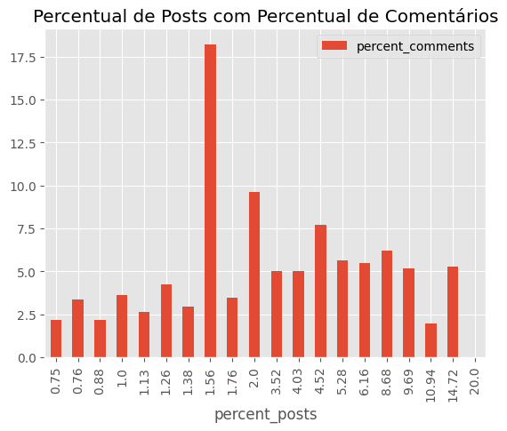
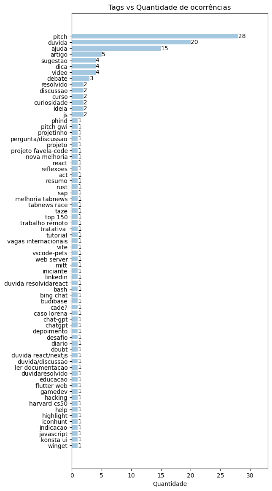
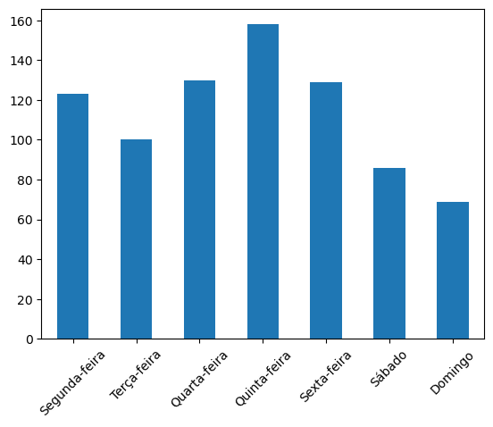
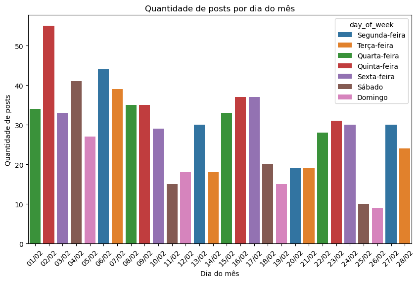
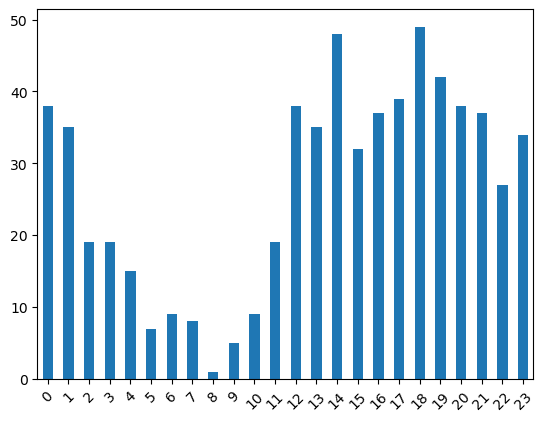

Análise de conteúdo tabnews (fevereiro de 2023)

Há um tempo descobri o site [tabnews](https://tabnews.com.br), uma espécie de agregador de notícias/rede social focada em tópicos de programação e tecnologia. É uma iniciativa do filipe deschamps, mas está sendo desenvolvido de forma comunitária através do seu [repositório do github](https://github.com/filipedeschamps/tabnews.com.br).

Dando uma explorada nos conteúdos reparei que as postagens costumam focar em tópicos como estudos e aprendizagem, busca de empregos, uso de inteligência artifical, projetos pessoais e notícias de tecnologia no geral.

Fiquei curioso sobre quais assuntos são mais populares e quais outros insights podemos ter sobre o conteúdo publicado na plataforma, então decidi fazer um levantamento dos dados existentes, visto que a API é aberta ao público :).

Optei por restringir a análise ao mês de fevereiro de 2023, onde o conjunto de dados é recente, mas não tem um tamanho que dificulte a manipulação.

Você pode acessar o código completo [neste notebook do kaggle](https://www.kaggle.com/guites/tabnews-analysis-february-2023).

## Coleta de dados no intervalo 02/2023 até 03/2023

Existe um [post](https://www.tabnews.com.br/GabrielSozinho/documentacao-da-api-do-tabnews) de referência como documentação da API. Usando ele como base, e tentando interpretar o [código fonte](https://github.com/filipedeschamps/tabnews.com.br/tree/main/pages/api/v1) dos endpoints, descobri o seguinte:

1. A URL base para listar as postagens é <https://www.tabnews.com.br/api/v1/contents>;
2. Os posts podem ser ordenados de acordo com três estratégias: "new", "old" e "relevant"
    1. "new" aplica um `ORDER BY published_at DESC`: mostra os posts mais recentes primeiro;
    2. "old" aplica um `ORDER BY published_at ASC`: mostra os posts mais antigos primeiro;
    3. "relevant" aplica um critério um pouco mais complexo, levando em conta o tempo de existência do post, o número de _tabcoins_ (tipo um upvote da plataforma) e algumas outras regrinhas(ver [`getContentScore`](https://github.com/filipedeschamps/tabnews.com.br/blob/main/models/content.js#L914));
3. O máximo de postagens retornadas por vez é 100;
4. Não existe um filtro específico por data;
5. Existem alguns cabeçalhos (`X-Pagination-Total-Rows` e `Link`) que auxiliam na navegação;
6. Existe um [endpoint](https://github.com/filipedeschamps/tabnews.com.br/blob/main/pages/api/v1/analytics/root-content-published/index.public.js) que retorna o número de postagens por dia num intervalo de 2 meses da data atual;

Vamos verificar o formato de um request básico, passando `new` como estratégia de ordenação.

    $ curl -I "https://www.tabnews.com.br/api/v1/contents?strategy=new"
    HTTP/2 200
    ...
    ..
    link: <https://www.tabnews.com.br/api/v1/contents?strategy=new&page=1&per_page=1>; rel="first", <https://www.tabnews.com.br/api/v1/contents?strategy=new&page=2&per_page=1>; rel="next", <https://www.tabnews.com.br/api/v1/contents?strategy=new&page=8153&per_page=1>; rel="last"
    x-pagination-total-rows: 8153
    ...
    ..

De acordo com o cabeçalho `x-pagination-total-rows`, temos um total de 8153 postagens. Podemos combinar essa informação com o número de posts por dia para descobrir quando começam os posts de fevereiro de 2023.

    $ curl https://www.tabnews.com.br/api/v1/analytics/root-content-published
    [
        {"date":"13/01","conteudos":38},
        {"date":"14/01","conteudos":29},
        {"date":"15/01","conteudos":30},
        {"date":"16/01","conteudos":50},
        {"date":"17/01","conteudos":37},
        {"date":"18/01","conteudos":44},
        ..
    ]

Podemos roubar aqui e selecionar apenas os valores partindo de 01/02, para somá-los com um filtro.

    $ echo '[{"date":"01/02","conteudos":46},{"date":"02/02","conteudos":66},{"date":"03/02","conteudos":43},{"date":"04/02","conteudos":43},{"date":"05/02","conteudos":31},{"date":"06/02","conteudos":55},{"date":"07/02","conteudos":51},{"date":"08/02","conteudos":46},{"date":"09/02","conteudos":47},{"date":"10/02","conteudos":39},{"date":"11/02","conteudos":18},{"date":"12/02","conteudos":19},{"date":"13/02","conteudos":40},{"date":"14/02","conteudos":29},{"date":"15/02","conteudos":45},{"date":"16/02","conteudos":54},{"date":"17/02","conteudos":48},{"date":"18/02","conteudos":21},{"date":"19/02","conteudos":18},{"date":"20/02","conteudos":27},{"date":"21/02","conteudos":27},{"date":"22/02","conteudos":37},{"date":"23/02","conteudos":38},{"date":"24/02","conteudos":41},{"date":"25/02","conteudos":10},{"date":"26/02","conteudos":13},{"date":"27/02","conteudos":51},{"date":"28/02","conteudos":38},{"date":"01/03","conteudos":21},{"date":"02/03","conteudos":35},{"date":"03/03","conteudos":35},{"date":"04/03","conteudos":21},{"date":"05/03","conteudos":15},{"date":"06/03","conteudos":28},{"date":"07/03","conteudos":27},{"date":"08/03","conteudos":40},{"date":"09/03","conteudos":37},{"date":"10/03","conteudos":31},{"date":"11/03","conteudos":29},{"date":"12/03","conteudos":23},{"date":"13/03","conteudos":34}]' \
    | jq "[.[].conteudos] | add"
    1417

1417! Esse é o número de postagens criadas des do início de fevereiro, até o dia atual.

1417 postagens / 100 posts por página ≈ 14 páginas: iniciamos as requisições na página 68 (82-14), onde deve estar o primeiro post de fevereiro, e vamos avançando até chegar no dia 28.

### Automatizando o processo

Um script em python vai nos ajudar a salvar os dados pra consulta futura.

A lógica é simples: fazer requisições na API partindo da página 68, salvando os resultados, e indo para a próxima página até atingirmos o primeiro post datado de março.

    request_loop = True # variável que define se devemos seguir para a próxima página
    february_posts = [] # lista que vai segurar todas as postagens

    base_url = "https://www.tabnews.com.br/api/v1"
    current_page = 68 # variável que segura o valor da página atual

    while request_loop:
        # concatenamos a url atual baseada no valor da página atual
        request_url = f"{base_url}/contents?strategy=old&page={current_page}&per_page=100"
        r = requests.get(request_url)
        posts = r.json()
        for post in posts:

            # caso o post atual for de antes de fevereiro, passamos para o próximo
            if published_before_february(post):
                continue

            # caso o post atual tiver a data de publicação maior que fevereiro
            # chegou a hora de parar nossa busca!
            if published_after_february(post):
                request_loop = False
                break

            february_posts.append(post)

        # incrementamos o contador, indo para a próxima página
        current_page = current_page + 1

        sleep(1)  # damos uma segurada pra não abusar do servidor :')

    with open("february.json", "w") as outfile:
        json.dump(february_posts, outfile)

O código acima vai ir de página em página (com 100 posts por página), partindo da 68 e aumentando sempre, até chegarmos no primeiro post de março. Nesse momento o loop acaba (a variável `request_loop` se torna `False`), e nós salvamos os posts no arquivo `february_posts.json`.

As funções `published_before_february` e `published_after_february` verificam se a data de publicação é anterior ou posterior a fevereiro, respectivamente:

        def published_before_february(request_body):
            """Returns whether the given post was `published_at` before 01/02/2023"""
            published_at = dt.strptime(request_body["published_at"], "%Y-%m-%dT%H:%M:%S.%fZ")
            return dt.strptime("2023-02-01", "%Y-%m-%d") > published_at

        def published_after_february(request_body):
            """Returns whether the given post was `published_at` after 28/02/2023"""
            published_at = dt.strptime(request_body["published_at"], "%Y-%m-%dT%H:%M:%S.%fZ")
            return published_at > dt.strptime("2023-02-28T23:59:59", "%Y-%m-%dT%H:%M:%S")

Com isso, vamos acumular todos os posts do mês de fevereiro para iniciar nossa análise.

Clique aqui para visualizar o script inteiro (40 linhas, ❤️ python)

    import json
    import requests

    from datetime import datetime as dt
    from time import sleep

    def published_before_february(request_body):
        """Returns whether the given post was `published_at` before 01/02/2023"""
        published_at = dt.strptime(request_body["published_at"], "%Y-%m-%dT%H:%M:%S.%fZ")
        return dt.strptime("2023-02-01", "%Y-%m-%d") > published_at

    def published_after_february(request_body):
        """Returns whether the given post was `published_at` after 28/02/2023"""
        published_at = dt.strptime(request_body["published_at"], "%Y-%m-%dT%H:%M:%S.%fZ")
        return published_at > dt.strptime("2023-02-28T23:59:59", "%Y-%m-%dT%H:%M:%S")

    base_url = "https://www.tabnews.com.br/api/v1"
    current_page = 68

    request_loop = True

    february_posts = []
    while request_loop:
        request_url = f"{base_url}/contents?strategy=old&page={current_page}&per_page=100"
        r = requests.get(request_url)
        posts = r.json()
        for post in posts:
            if published_before_february(post):
                continue
            if published_after_february(post):
                request_loop = False
                break
            february_posts.append(post)
        current_page = current_page + 1
        sleep(1)  # prevent abuse :')

    with open("february.json", "w") as outfile:
        json.dump(february_posts, outfile)

<aside>Caso você rodar esse script no futuro, a página inicial provavelmente vai ser muito maior que a 68.</aside>

## Análises iniciais

Vamos começar carregando o arquivo json como um dataframe.

    df = pd.read_json("./february.json")

Com isso, podemos pegar algumas informações básicas.

    $ df.shape
    (935, 14)

**Foram publicados 935 posts em fevereiro**.

    df.head()

<table class="dataframe" border="1">
  <thead>
    <tr style="text-align: right;">
      <th></th>
      <th>id</th>
      <th>owner_id</th>
      <th>parent_id</th>
      <th>slug</th>
      <th>title</th>
      <th>status</th>
      <th>source_url</th>
      <th>created_at</th>
      <th>updated_at</th>
      <th>published_at</th>
      <th>deleted_at</th>
      <th>owner_username</th>
      <th>tabcoins</th>
      <th>children_deep_count</th>
    </tr>
  </thead>
  <tbody>
    <tr>
      <th>0</th>
      <td>6190e4fe-4aa3-4557-b69a-f42ac8765715</td>
      <td>6e750ada-d106-4a6f-bd1e-c4c5a9d3b7f6</td>
      <td>NaN</td>
      <td>imersao-dev-aula-1-expandindo-os-conhecimentos</td>
      <td>Imersão Dev - Aula 1 | Expandindo os Conhecime...</td>
      <td>published</td>
      <td>None</td>
      <td>2023-02-01 00:14:05.031000+00:00</td>
      <td>2023-02-01 00:14:23.724000+00:00</td>
      <td>2023-02-01 00:14:05.054000+00:00</td>
      <td>NaT</td>
      <td>TheDevick</td>
      <td>1</td>
      <td>2</td>
    </tr>
    <tr>
      <th>1</th>
      <td>c2347a33-28dd-4c03-9127-012d9b61cd82</td>
      <td>f6b5df28-4810-4f94-a523-53be17fffbc6</td>
      <td>NaN</td>
      <td>desenvolvedor-react-em-inicio-de-carreira</td>
      <td>Desenvolvedor React em início de carreira</td>
      <td>published</td>
      <td>None</td>
      <td>2023-02-01 00:24:06.513000+00:00</td>
      <td>2023-02-01 00:24:06.513000+00:00</td>
      <td>2023-02-01 00:24:06.537000+00:00</td>
      <td>NaT</td>
      <td>kevensouzz</td>
      <td>1</td>
      <td>4</td>
    </tr>
    <tr>
      <th>2</th>
      <td>447f4db9-9570-4b29-bce5-48c3195879e1</td>
      <td>c8a4bd72-1edd-4ca4-96b6-0310d0f53457</td>
      <td>NaN</td>
      <td>10-dicas-simples-para-melhorar-como-programado...</td>
      <td>10 dicas simples para melhorar como programado...</td>
      <td>published</td>
      <td>None</td>
      <td>2023-02-01 00:45:36.751000+00:00</td>
      <td>2023-02-01 00:49:18.821000+00:00</td>
      <td>2023-02-01 00:45:36.761000+00:00</td>
      <td>NaT</td>
      <td>roneydc</td>
      <td>1</td>
      <td>0</td>
    </tr>
    <tr>
      <th>3</th>
      <td>6c0744af-c140-4915-ac3c-d73cc0e53f9a</td>
      <td>c8a4bd72-1edd-4ca4-96b6-0310d0f53457</td>
      <td>NaN</td>
      <td>vamos-falar-sobre-linguangem-orientadas-a-objetos</td>
      <td>1 - Vamos falar sobre linguangem orientada a o...</td>
      <td>published</td>
      <td>None</td>
      <td>2023-02-01 00:56:42.619000+00:00</td>
      <td>2023-02-01 01:08:07.698000+00:00</td>
      <td>2023-02-01 00:56:42.643000+00:00</td>
      <td>NaT</td>
      <td>roneydc</td>
      <td>-1</td>
      <td>2</td>
    </tr>
    <tr>
      <th>4</th>
      <td>05a8f1e2-4bc5-4a9f-861b-8fcb64e8689f</td>
      <td>c8a4bd72-1edd-4ca4-96b6-0310d0f53457</td>
      <td>NaN</td>
      <td>2-um-pequeno-exemplo-de-orientacao-a-objeto-py...</td>
      <td>2 - Um pequeno exemplo de orientação a objeto ...</td>
      <td>published</td>
      <td>None</td>
      <td>2023-02-01 01:07:57.037000+00:00</td>
      <td>2023-02-01 01:07:57.037000+00:00</td>
      <td>2023-02-01 01:07:57.051000+00:00</td>
      <td>NaT</td>
      <td>roneydc</td>
      <td>0</td>
      <td>0</td>
    </tr>
  </tbody>
</table>

### Limpando os dados

Existe uma conta, [NewsletterOficial](https://www.tabnews.com.br/NewsletterOficial) que faz postagens regulares de notícias de outros sites. Como a ideia é entender o relacionamento entre usuários, vamos remover os posts da Newsletter do nosso dataset.

    df = df.query('owner_username != "NewsletterOficial"')

Para facilitar a identificação, vamos remover algumas colunas que não são de interesse (id, owner\_id, parent\_id, status, created\_at, updated\_at, deleted\_at).

    df = df[[
        #'id',
        #'owner_id',
        #'parent_id',
        'slug',
        'title',
        #'status',
        'source_url',
        #'created_at',
        #'updated_at',
        'published_at',
        #'deleted_at',
        'owner_username',
        'tabcoins',
        'children_deep_count'
    ]]

Vamos aproveitar pra renomear a coluna "children\_deep\_count" para "comments" e a coluna "owner\_username" para "username".

    df = df.rename(
        columns={
            'children_deep_count':'comments',
            'owner_username': 'username'
        }
    )

Vamos puxar uma descrição básica do nosso dataset:

    df.describe()

    <table class="dataframe" border="1">
      <thead>
        <tr style="text-align: right;">
          <th></th>
          <th>parent_id</th>
          <th>tabcoins</th>
          <th>comments</th>
        </tr>
      </thead>
      <tbody>
        <tr>
          <th>count</th>
          <td>0.0</td>
          <td>795.000000</td>
          <td>795.000000</td>
        </tr>
        <tr>
          <th>mean</th>
          <td>NaN</td>
          <td>3.373585</td>
          <td>5.596226</td>
        </tr>
        <tr>
          <th>std</th>
          <td>NaN</td>
          <td>7.522933</td>
          <td>13.093704</td>
        </tr>
        <tr>
          <th>min</th>
          <td>NaN</td>
          <td>-12.000000</td>
          <td>0.000000</td>
        </tr>
        <tr>
          <th>25%</th>
          <td>NaN</td>
          <td>1.000000</td>
          <td>1.000000</td>
        </tr>
        <tr>
          <th>50%</th>
          <td>NaN</td>
          <td>1.000000</td>
          <td>3.000000</td>
        </tr>
        <tr>
          <th>75%</th>
          <td>NaN</td>
          <td>3.000000</td>
          <td>6.000000</td>
        </tr>
        <tr>
          <th>max</th>
          <td>NaN</td>
          <td>82.000000</td>
          <td>301.000000</td>
        </tr>
      </tbody>
    </table>

Nos restam **795 posts criados por usuários normais**.

**A metade das postagens (50%) não atinge mais de três comentário.**

**Três quartos das postagens (75%) não atinge 3 tabcoins**! Levando em conta que todo post "nasce" com 1 tabcoin, a vaca tá magra.

Vamos descobrir o valor total de comentários realizados e o total de tabcoins recebidos pelas postagens do mês.

    $ print(f"Total de tabcoins recebidos: {df['tabcoins'].sum()}\nTotal de comentários realizados: {df['comments'].sum()}")

Total de tabcoins recebidos: **2682**

Total de comentários realizados: **4449**

### Distribuição de comentários

Quantos posts tiveram pelo menos um comentário?

    $ df.query('comments > 0')['comments'].count()
    636

**80% das postagens receberam ao menos um comentário**!

Qual a distribuição de comentários por post?

    comments_distrib = pd.DataFrame(
        df.groupby(['comments'])['comments'] \
        .count()
    ).rename(columns={"comments": "num_posts"}) \
    .reset_index()

Vamos agrupar nosso dataset pelo número de comentários, e verificar o percentual de cada um em relação ao número total de postagens.

    comments_distrib['percent_posts'] = (comments_distrib['num_posts'] / 795) * 100

Outra relação interessante é quantos % dos comentários do site se encontram nesses posts.

Por exemplo, quantos porcento dos comentários totais foram feitos em posts com 2, 3 ou 5 comentários?

    comments_distrib['percent_comments'] = ((comments_distrib['comments'] * comments_distrib['num_posts']) / 4449) * 100

Vamos adicionar também um contador com o total de comentários pra cada número de comentários.

    comments_distrib['total_comments'] = comments_distrib['num_posts'] * comments_distrib['comments']

Vamos usar uma função para formatar os valores percentuais com duas casas decimais.

    def format_two_decimals(x):
        return float("%.2f" % x);

    comments_distrib['percent_posts'] = comments_distrib['percent_posts'].apply(format_two_decimals)
    comments_distrib['percent_comments'] = comments_distrib['percent_comments'].apply(format_two_decimals)

<table class="dataframe" border="1">
  <thead>
    <tr style="text-align: right;">
      <th></th>
      <th>comments</th>
      <th>num_posts</th>
      <th>total_comments</th>
      <th>percent_posts</th>
      <th>percent_comments</th>
    </tr>
  </thead>
  <tbody>
    <tr>
      <th>41</th>
      <td>301</td>
      <td>1</td>
      <td>301</td>
      <td>0.13</td>
      <td>6.77</td>
    </tr>
    <tr>
      <th>4</th>
      <td>4</td>
      <td>69</td>
      <td>276</td>
      <td>8.68</td>
      <td>6.20</td>
    </tr>
    <tr>
      <th>6</th>
      <td>6</td>
      <td>42</td>
      <td>252</td>
      <td>5.28</td>
      <td>5.66</td>
    </tr>
    <tr>
      <th>5</th>
      <td>5</td>
      <td>49</td>
      <td>245</td>
      <td>6.16</td>
      <td>5.51</td>
    </tr>
    <tr>
      <th>2</th>
      <td>2</td>
      <td>117</td>
      <td>234</td>
      <td>14.72</td>
      <td>5.26</td>
    </tr>
    <tr>
      <th>3</th>
      <td>3</td>
      <td>77</td>
      <td>231</td>
      <td>9.69</td>
      <td>5.19</td>
    </tr>
    <tr>
      <th>7</th>
      <td>7</td>
      <td>32</td>
      <td>224</td>
      <td>4.03</td>
      <td>5.03</td>
    </tr>
    <tr>
      <th>8</th>
      <td>8</td>
      <td>28</td>
      <td>224</td>
      <td>3.52</td>
      <td>5.03</td>
    </tr>
    <tr>
      <th>10</th>
      <td>10</td>
      <td>18</td>
      <td>180</td>
      <td>2.26</td>
      <td>4.05</td>
    </tr>
    <tr>
      <th>9</th>
      <td>9</td>
      <td>18</td>
      <td>162</td>
      <td>2.26</td>
      <td>3.64</td>
    </tr>
    <tr>
      <th>11</th>
      <td>11</td>
      <td>14</td>
      <td>154</td>
      <td>1.76</td>
      <td>3.46</td>
    </tr>
    <tr>
      <th>12</th>
      <td>12</td>
      <td>11</td>
      <td>132</td>
      <td>1.38</td>
      <td>2.97</td>
    </tr>
    <tr>
      <th>13</th>
      <td>13</td>
      <td>9</td>
      <td>117</td>
      <td>1.13</td>
      <td>2.63</td>
    </tr>
    <tr>
      <th>25</th>
      <td>25</td>
      <td>4</td>
      <td>100</td>
      <td>0.50</td>
      <td>2.25</td>
    </tr>
    <tr>
      <th>20</th>
      <td>20</td>
      <td>5</td>
      <td>100</td>
      <td>0.63</td>
      <td>2.25</td>
    </tr>
    <tr>
      <th>14</th>
      <td>14</td>
      <td>7</td>
      <td>98</td>
      <td>0.88</td>
      <td>2.20</td>
    </tr>
    <tr>
      <th>16</th>
      <td>16</td>
      <td>6</td>
      <td>96</td>
      <td>0.75</td>
      <td>2.16</td>
    </tr>
    <tr>
      <th>18</th>
      <td>18</td>
      <td>5</td>
      <td>90</td>
      <td>0.63</td>
      <td>2.02</td>
    </tr>
    <tr>
      <th>1</th>
      <td>1</td>
      <td>87</td>
      <td>87</td>
      <td>10.94</td>
      <td>1.96</td>
    </tr>
    <tr>
      <th>40</th>
      <td>84</td>
      <td>1</td>
      <td>84</td>
      <td>0.13</td>
      <td>1.89</td>
    </tr>
    <tr>
      <th>26</th>
      <td>26</td>
      <td>3</td>
      <td>78</td>
      <td>0.38</td>
      <td>1.75</td>
    </tr>
    <tr>
      <th>39</th>
      <td>76</td>
      <td>1</td>
      <td>76</td>
      <td>0.13</td>
      <td>1.71</td>
    </tr>
    <tr>
      <th>33</th>
      <td>36</td>
      <td>2</td>
      <td>72</td>
      <td>0.25</td>
      <td>1.62</td>
    </tr>
    <tr>
      <th>24</th>
      <td>24</td>
      <td>3</td>
      <td>72</td>
      <td>0.38</td>
      <td>1.62</td>
    </tr>
    <tr>
      <th>38</th>
      <td>71</td>
      <td>1</td>
      <td>71</td>
      <td>0.13</td>
      <td>1.60</td>
    </tr>
    <tr>
      <th>32</th>
      <td>35</td>
      <td>2</td>
      <td>70</td>
      <td>0.25</td>
      <td>1.57</td>
    </tr>
    <tr>
      <th>31</th>
      <td>32</td>
      <td>2</td>
      <td>64</td>
      <td>0.25</td>
      <td>1.44</td>
    </tr>
    <tr>
      <th>29</th>
      <td>30</td>
      <td>2</td>
      <td>60</td>
      <td>0.25</td>
      <td>1.35</td>
    </tr>
    <tr>
      <th>15</th>
      <td>15</td>
      <td>4</td>
      <td>60</td>
      <td>0.50</td>
      <td>1.35</td>
    </tr>
    <tr>
      <th>23</th>
      <td>23</td>
      <td>2</td>
      <td>46</td>
      <td>0.25</td>
      <td>1.03</td>
    </tr>
    <tr>
      <th>22</th>
      <td>22</td>
      <td>2</td>
      <td>44</td>
      <td>0.25</td>
      <td>0.99</td>
    </tr>
    <tr>
      <th>37</th>
      <td>44</td>
      <td>1</td>
      <td>44</td>
      <td>0.13</td>
      <td>0.99</td>
    </tr>
    <tr>
      <th>36</th>
      <td>43</td>
      <td>1</td>
      <td>43</td>
      <td>0.13</td>
      <td>0.97</td>
    </tr>
    <tr>
      <th>35</th>
      <td>42</td>
      <td>1</td>
      <td>42</td>
      <td>0.13</td>
      <td>0.94</td>
    </tr>
    <tr>
      <th>34</th>
      <td>41</td>
      <td>1</td>
      <td>41</td>
      <td>0.13</td>
      <td>0.92</td>
    </tr>
    <tr>
      <th>19</th>
      <td>19</td>
      <td>2</td>
      <td>38</td>
      <td>0.25</td>
      <td>0.85</td>
    </tr>
    <tr>
      <th>17</th>
      <td>17</td>
      <td>2</td>
      <td>34</td>
      <td>0.25</td>
      <td>0.76</td>
    </tr>
    <tr>
      <th>30</th>
      <td>31</td>
      <td>1</td>
      <td>31</td>
      <td>0.13</td>
      <td>0.70</td>
    </tr>
    <tr>
      <th>28</th>
      <td>28</td>
      <td>1</td>
      <td>28</td>
      <td>0.13</td>
      <td>0.63</td>
    </tr>
    <tr>
      <th>27</th>
      <td>27</td>
      <td>1</td>
      <td>27</td>
      <td>0.13</td>
      <td>0.61</td>
    </tr>
    <tr>
      <th>21</th>
      <td>21</td>
      <td>1</td>
      <td>21</td>
      <td>0.13</td>
      <td>0.47</td>
    </tr>
    <tr>
      <th>0</th>
      <td>0</td>
      <td>159</td>
      <td>0</td>
      <td>20.00</td>
      <td>0.00</td>
    </tr>
  </tbody>
</table>

Existe uma grande concentração de comentários em poucos posts. Se ordenarmos pelo número de comentários por post, os que possuem maior número de comentário tem baixa ocorrência (como é de se esperar).

    comments_distrib.sort_values(by=['comments'], ascending=False).head(10)

<table class="dataframe" border="1">
  <thead>
    <tr style="text-align: right;">
      <th></th>
      <th>comments</th>
      <th>num_posts</th>
      <th>total_comments</th>
      <th>percent_posts</th>
      <th>percent_comments</th>
    </tr>
  </thead>
  <tbody>
    <tr>
      <th>41</th>
      <td>301</td>
      <td>1</td>
      <td>301</td>
      <td>0.13</td>
      <td>6.77</td>
    </tr>
    <tr>
      <th>40</th>
      <td>84</td>
      <td>1</td>
      <td>84</td>
      <td>0.13</td>
      <td>1.89</td>
    </tr>
    <tr>
      <th>39</th>
      <td>76</td>
      <td>1</td>
      <td>76</td>
      <td>0.13</td>
      <td>1.71</td>
    </tr>
    <tr>
      <th>38</th>
      <td>71</td>
      <td>1</td>
      <td>71</td>
      <td>0.13</td>
      <td>1.60</td>
    </tr>
    <tr>
      <th>37</th>
      <td>44</td>
      <td>1</td>
      <td>44</td>
      <td>0.13</td>
      <td>0.99</td>
    </tr>
    <tr>
      <th>36</th>
      <td>43</td>
      <td>1</td>
      <td>43</td>
      <td>0.13</td>
      <td>0.97</td>
    </tr>
    <tr>
      <th>35</th>
      <td>42</td>
      <td>1</td>
      <td>42</td>
      <td>0.13</td>
      <td>0.94</td>
    </tr>
    <tr>
      <th>34</th>
      <td>41</td>
      <td>1</td>
      <td>41</td>
      <td>0.13</td>
      <td>0.92</td>
    </tr>
    <tr>
      <th>33</th>
      <td>36</td>
      <td>2</td>
      <td>72</td>
      <td>0.25</td>
      <td>1.62</td>
    </tr>
    <tr>
      <th>32</th>
      <td>35</td>
      <td>2</td>
      <td>70</td>
      <td>0.25</td>
      <td>1.57</td>
    </tr>
  </tbody>
</table>

Podemos agrupar pelo número de ocorrências (`num_posts`) para entender como esses posts populares impactam no conteúdo produzido pela plataforma.

    comments_by_num_posts = comments_distrib.groupby('num_posts') \
    .agg(
        {
            'num_posts': 'sum',
            'percent_posts': 'sum',
            'percent_comments': 'sum',
            'comments': 'sum',
            'total_comments': 'sum',
        }
    ) \
    .rename(columns={'num_posts': 'total_posts'}) \
    .reset_index(drop=False) \
    .sort_values(by=['comments'], ascending=False)
    print(comments_by_num_posts)

<table class="dataframe" border="1">
  <thead>
    <tr style="text-align: right;">
      <th></th>
      <th>num_posts</th>
      <th>total_posts</th>
      <th>percent_posts</th>
      <th>percent_comments</th>
      <th>comments</th>
      <th>total_comments</th>
    </tr>
  </thead>
  <tbody>
    <tr>
      <th>0</th>
      <td>1</td>
      <td>12</td>
      <td>1.56</td>
      <td>18.20</td>
      <td>809</td>
      <td>809</td>
    </tr>
    <tr>
      <th>1</th>
      <td>2</td>
      <td>16</td>
      <td>2.00</td>
      <td>9.61</td>
      <td>214</td>
      <td>428</td>
    </tr>
    <tr>
      <th>2</th>
      <td>3</td>
      <td>6</td>
      <td>0.76</td>
      <td>3.37</td>
      <td>50</td>
      <td>150</td>
    </tr>
    <tr>
      <th>3</th>
      <td>4</td>
      <td>8</td>
      <td>1.00</td>
      <td>3.60</td>
      <td>40</td>
      <td>160</td>
    </tr>
    <tr>
      <th>4</th>
      <td>5</td>
      <td>10</td>
      <td>1.26</td>
      <td>4.27</td>
      <td>38</td>
      <td>190</td>
    </tr>
    <tr>
      <th>10</th>
      <td>18</td>
      <td>36</td>
      <td>4.52</td>
      <td>7.69</td>
      <td>19</td>
      <td>342</td>
    </tr>
    <tr>
      <th>5</th>
      <td>6</td>
      <td>6</td>
      <td>0.75</td>
      <td>2.16</td>
      <td>16</td>
      <td>96</td>
    </tr>
    <tr>
      <th>6</th>
      <td>7</td>
      <td>7</td>
      <td>0.88</td>
      <td>2.20</td>
      <td>14</td>
      <td>98</td>
    </tr>
    <tr>
      <th>7</th>
      <td>9</td>
      <td>9</td>
      <td>1.13</td>
      <td>2.63</td>
      <td>13</td>
      <td>117</td>
    </tr>
    <tr>
      <th>8</th>
      <td>11</td>
      <td>11</td>
      <td>1.38</td>
      <td>2.97</td>
      <td>12</td>
      <td>132</td>
    </tr>
    <tr>
      <th>9</th>
      <td>14</td>
      <td>14</td>
      <td>1.76</td>
      <td>3.46</td>
      <td>11</td>
      <td>154</td>
    </tr>
    <tr>
      <th>11</th>
      <td>28</td>
      <td>28</td>
      <td>3.52</td>
      <td>5.03</td>
      <td>8</td>
      <td>224</td>
    </tr>
    <tr>
      <th>12</th>
      <td>32</td>
      <td>32</td>
      <td>4.03</td>
      <td>5.03</td>
      <td>7</td>
      <td>224</td>
    </tr>
    <tr>
      <th>13</th>
      <td>42</td>
      <td>42</td>
      <td>5.28</td>
      <td>5.66</td>
      <td>6</td>
      <td>252</td>
    </tr>
    <tr>
      <th>14</th>
      <td>49</td>
      <td>49</td>
      <td>6.16</td>
      <td>5.51</td>
      <td>5</td>
      <td>245</td>
    </tr>
    <tr>
      <th>15</th>
      <td>69</td>
      <td>69</td>
      <td>8.68</td>
      <td>6.20</td>
      <td>4</td>
      <td>276</td>
    </tr>
    <tr>
      <th>16</th>
      <td>77</td>
      <td>77</td>
      <td>9.69</td>
      <td>5.19</td>
      <td>3</td>
      <td>231</td>
    </tr>
    <tr>
      <th>18</th>
      <td>117</td>
      <td>117</td>
      <td>14.72</td>
      <td>5.26</td>
      <td>2</td>
      <td>234</td>
    </tr>
    <tr>
      <th>17</th>
      <td>87</td>
      <td>87</td>
      <td>10.94</td>
      <td>1.96</td>
      <td>1</td>
      <td>87</td>
    </tr>
    <tr>
      <th>19</th>
      <td>159</td>
      <td>159</td>
      <td>20.00</td>
      <td>0.00</td>
      <td>0</td>
      <td>0</td>
    </tr>
  </tbody>
</table>

Podemos ver que **18.2% dos comentários ficaram acumulados em menos de 2% das postagens**.

Esse acumulo de comentários pode ser visualizado plotando o percentual de posts pelo percentual de comentários.

    comments_by_num_posts.sort_values(by=['percent_posts']).plot(kind='bar', x='percent_posts', y='percent_comments', title='Percentual de Posts vs Percentual de Comentários')
    plt.show()

## Encontrando tags nas postagens

O Tabnews utiliza um sistema onde o pessoal _taggeia_ seus posts manualmente, usando colchetes ou `categoria: título do post`.

**Quais foram as tags mais utilizadas?**

Vamos iterar sobre os posts e criar uma nova coluna "tags" extraindo os valores dos títulos que estiverem nos dois formatos listados acima.

    def find_tags(row):
        title = row['title']
        has_tag = re.search("^.*:", title)
        has_colchete_tags = re.search("\[.*\]", title)
        if has_tag:
            return has_tag.group(0)
        elif has_colchete_tags:
            return has_colchete_tags.group(0)
        return ""

    df['tags'] = df.apply(find_tags, axis=1)
    df.query('tags != ""')[['title', 'tags']]

<table class="dataframe" border="1">
  <thead>
    <tr style="text-align: right;">
      <th></th>
      <th>title</th>
      <th>tags</th>
    </tr>
  </thead>
  <tbody>
    <tr>
      <th>8</th>
      <td>Ler documentação: como isso me ajudou a progra...</td>
      <td>Ler documentação:</td>
    </tr>
    <tr>
      <th>11</th>
      <td>[DICA] Tabela de nomes curtos para variáveis l...</td>
      <td>[DICA]</td>
    </tr>
    <tr>
      <th>12</th>
      <td>Compreendendo o CSS: A Linguagem de estilo par...</td>
      <td>Compreendendo o CSS:</td>
    </tr>
    <tr>
      <th>24</th>
      <td>[Ajuda] Api para finança eur/usd</td>
      <td>[Ajuda]</td>
    </tr>
    <tr>
      <th>26</th>
      <td>[JS] Problema ao movimentar o jogador pelo &lt;ca...</td>
      <td>[JS]</td>
    </tr>
    <tr>
      <th>...</th>
      <td>...</td>
      <td>...</td>
    </tr>
    <tr>
      <th>909</th>
      <td>Pitch: Como eu e meu colega de time estamos es...</td>
      <td>Pitch:</td>
    </tr>
    <tr>
      <th>921</th>
      <td>Abordagem de humor, mas crítica, sobre a adoçã...</td>
      <td>[Vídeo]</td>
    </tr>
    <tr>
      <th>922</th>
      <td>O chatbot que nunca entende: como depurar um m...</td>
      <td>O chatbot que nunca entende:</td>
    </tr>
    <tr>
      <th>925</th>
      <td>Konsta UI: replicação "Pixel Perfect" de iOS e...</td>
      <td>Konsta UI:</td>
    </tr>
    <tr>
      <th>929</th>
      <td>Redis vs. outros bancos de dados NoSQL: Prós e...</td>
      <td>Redis vs. outros bancos de dados NoSQL:</td>
    </tr>
  </tbody>
</table>

201 rows  x 2 columns

**201** posts parecem ter algum tipo de tag no título.

Parece que muitos usuários usam os dois pontos (`:`) sem o intuito de tag.

Vamos limpar as tags encontradas e verificar se existe algum padrão.

Pra isso, instalamos o pacote `unidecode`, que remove acentos, cedilhas e outros caracteres especiaisporpadrão.

    !pip install unidecode --quiet
    from unidecode import unidecode

Depois, vamos aplicar mais um filtro na coluna `tags`.

    # remover acentos, símbolos e mesclar minusculas com maíusculas
    def strip_func(row):
        tags = row['tags']
        if tags == "":
            return tags
        rm_symbols = [',', '!', '.', ';', '[', ']', ':']
        tags = unidecode(tags).lower()
        return tags.translate({ord(x): '' for x in rm_symbols})

    df['tags'] = df.apply(strip_func, axis=1)

Algumas tags parecem populares:

    df.query('tags != ""') \
    .groupby('tags') \
    .count() \
    .sort_values(
        by=['title'],
        ascending=False
    ) \
    .head(10)

    <table class="dataframe" border="1">
      <thead>
        <tr style="text-align: right;">
          <th></th>
          <th>slug</th>
          <th>title</th>
          <th>source_url</th>
          <th>published_at</th>
          <th>username</th>
          <th>tabcoins</th>
          <th>comments</th>
        </tr>
        <tr>
          <th>tags</th>
          <th></th>
          <th></th>
          <th></th>
          <th></th>
          <th></th>
          <th></th>
          <th></th>
        </tr>
      </thead>
      <tbody>
        <tr>
          <th>pitch</th>
          <td>28</td>
          <td>28</td>
          <td>6</td>
          <td>28</td>
          <td>28</td>
          <td>28</td>
          <td>28</td>
        </tr>
        <tr>
          <th>duvida</th>
          <td>20</td>
          <td>20</td>
          <td>1</td>
          <td>20</td>
          <td>20</td>
          <td>20</td>
          <td>20</td>
        </tr>
        <tr>
          <th>ajuda</th>
          <td>15</td>
          <td>15</td>
          <td>1</td>
          <td>15</td>
          <td>15</td>
          <td>15</td>
          <td>15</td>
        </tr>
        <tr>
          <th>artigo</th>
          <td>5</td>
          <td>5</td>
          <td>1</td>
          <td>5</td>
          <td>5</td>
          <td>5</td>
          <td>5</td>
        </tr>
        <tr>
          <th>dica</th>
          <td>4</td>
          <td>4</td>
          <td>0</td>
          <td>4</td>
          <td>4</td>
          <td>4</td>
          <td>4</td>
        </tr>
        <tr>
          <th>sugestao</th>
          <td>4</td>
          <td>4</td>
          <td>0</td>
          <td>4</td>
          <td>4</td>
          <td>4</td>
          <td>4</td>
        </tr>
        <tr>
          <th>video</th>
          <td>4</td>
          <td>4</td>
          <td>0</td>
          <td>4</td>
          <td>4</td>
          <td>4</td>
          <td>4</td>
        </tr>
        <tr>
          <th>blog do seu ze</th>
          <td>3</td>
          <td>3</td>
          <td>0</td>
          <td>3</td>
          <td>3</td>
          <td>3</td>
          <td>3</td>
        </tr>
        <tr>
          <th>debate</th>
          <td>3</td>
          <td>3</td>
          <td>0</td>
          <td>3</td>
          <td>3</td>
          <td>3</td>
          <td>3</td>
        </tr>
        <tr>
          <th>ideia</th>
          <td>2</td>
          <td>2</td>
          <td>0</td>
          <td>2</td>
          <td>2</td>
          <td>2</td>
          <td>2</td>
        </tr>
      </tbody>
    </table>

Vamos entender o tamanho médio das tags, em número de palavras, para aprimorar nosso filtro.

    def get_tag_word_size(row):
        tags = row['tags']
        if tags == "":
            return 0
        return len(tags.split(" "))

    df['tag_word_size'] = df.apply(get_tag_word_size, axis=1)
    df.query('tags != ""').describe()

    <table class="dataframe" border="1">
      <thead>
        <tr style="text-align: right;">
          <th></th>
          <th>tabcoins</th>
          <th>comments</th>
          <th>tag_word_size</th>
        </tr>
      </thead>
      <tbody>
        <tr>
          <th>count</th>
          <td>201.000000</td>
          <td>201.000000</td>
          <td>201.000000</td>
        </tr>
        <tr>
          <th>mean</th>
          <td>3.706468</td>
          <td>6.726368</td>
          <td>2.084577</td>
        </tr>
        <tr>
          <th>std</th>
          <td>8.486955</td>
          <td>22.174078</td>
          <td>2.246733</td>
        </tr>
        <tr>
          <th>min</th>
          <td>-5.000000</td>
          <td>0.000000</td>
          <td>1.000000</td>
        </tr>
        <tr>
          <th>25%</th>
          <td>1.000000</td>
          <td>1.000000</td>
          <td>1.000000</td>
        </tr>
        <tr>
          <th>50%</th>
          <td>1.000000</td>
          <td>4.000000</td>
          <td>1.000000</td>
        </tr>
        <tr>
          <th>75%</th>
          <td>3.000000</td>
          <td>6.000000</td>
          <td>3.000000</td>
        </tr>
        <tr>
          <th>max</th>
          <td>82.000000</td>
          <td>301.000000</td>
          <td>16.000000</td>
        </tr>
      </tbody>
    </table>

**2 palavras** parece ser um bom ponto de corte, visto que 50% das tags encontradas se encaixa nesse valor.

    plot_data =  df.query('tags != "" and tag_word_size > 0 and tag_word_size <= 2') \
    .groupby('tags') \
    .count() \
    .reset_index() \
    .sort_values(
        by=['title'],
        ascending=False
    )

### Visualização de tags em gráfico de barras

Uma forma boa de visualizar essa distribuição é com um gráfico de barras horizontal.

    %matplotlib inline

    tags = plot_data['tags']
    count = plot_data['title']

    y_pos = np.arange(len(count))

    fig = plt.figure(figsize=(6,14))
    ax = fig.add_subplot()
    hbars = ax.barh(y_pos, count, align='center',alpha=0.4)

    ax.set_yticks(y_pos, labels=tags)
    ax.invert_yaxis()  # labels read top-to-bottom
    ax.set_xlabel('Quantidade')
    ax.set_title('Tags vs Quantidade de ocorrências')

    ax.bar_label(hbars)
    ax.set_xlim(right=max(count) +5)
    plt.show()

O gráfico nos dá uma boa visão geral da distribuição, mas como muitas tags aparecem uma única vez, e poucas tags aparecem muitas vezes, uma visão espacial pode nos dar um insight melhor sobre a frequência do seu uso.

Vamos gerar duas wordclouds: uma com apenas tags de uma palavra e, na segunda, vamos permitir tags de até duas palavras.

### Wordcloud com tags de uma única palavra

Vamos alimentar as tags existentes, filtrando as que possuem uma única palavra.

    from wordcloud import WordCloud, STOPWORDS

A lib wordcloud espera uma string contendo a totalidade das palavras, e usa o espaço como delimitador.

    text = " ".join(df.query('tag_word_size == 1')['tags'])

    wordcloud = WordCloud(
        width= 3000,
        height = 2000,
        random_state=1,
        background_color='salmon',
        colormap='Pastel1',
        collocations=False,
        stopwords = STOPWORDS
    ).generate(text)

    plt.figure(figsize=(40, 30))
    plt.imshow(wordcloud)
    plt.axis("off");

## Distribuição temporal das postagens

Vamos entender como foi a distribuição dos posts ao longo do tempo.

Primeiro, podemos usar o campo `published_at` para visualizar os posts em função dos dias da semana.

    df['day_of_week'] = df['published_at'].dt.day_name()
    df['day_number'] = df['published_at'].dt.dayofweek
    df[['title', 'published_at', 'username', 'day_of_week', 'day_number']].head()

<table class="dataframe" border="1">
  <thead>
    <tr style="text-align: right;">
      <th></th>
      <th>title</th>
      <th>published_at</th>
      <th>username</th>
      <th>day_of_week</th>
      <th>day_number</th>
    </tr>
  </thead>
  <tbody>
    <tr>
      <th>0</th>
      <td>Imersão Dev - Aula 1 | Expandindo os Conhecime...</td>
      <td>2023-02-01 00:14:05.054000+00:00</td>
      <td>TheDevick</td>
      <td>Wednesday</td>
      <td>2</td>
    </tr>
    <tr>
      <th>1</th>
      <td>Desenvolvedor React em início de carreira</td>
      <td>2023-02-01 00:24:06.537000+00:00</td>
      <td>kevensouzz</td>
      <td>Wednesday</td>
      <td>2</td>
    </tr>
    <tr>
      <th>2</th>
      <td>10 dicas simples para melhorar como programado...</td>
      <td>2023-02-01 00:45:36.761000+00:00</td>
      <td>roneydc</td>
      <td>Wednesday</td>
      <td>2</td>
    </tr>
    <tr>
      <th>3</th>
      <td>1 - Vamos falar sobre linguangem orientada a o...</td>
      <td>2023-02-01 00:56:42.643000+00:00</td>
      <td>roneydc</td>
      <td>Wednesday</td>
      <td>2</td>
    </tr>
    <tr>
      <th>4</th>
      <td>2 - Um pequeno exemplo de orientação a objeto ...</td>
      <td>2023-02-01 01:07:57.051000+00:00</td>
      <td>roneydc</td>
      <td>Wednesday</td>
      <td>2</td>
    </tr>
  </tbody>
</table>

O campo `day_number` vai ser usado para ordenar nossos resultados mais pra frente.

Rodando localmente, poderiamos usar o argumento `locale="pt_BR.utf8` pra receber as datas em português, mas o notebook do kaggle parece não ter esse padrão instalado. Vamos fazer um ajuste.

    weekdays_ptbr = {
        "Monday": "Segunda-feira",
        "Tuesday": "Terça-feira",
        "Wednesday": "Quarta-feira",
        "Thursday": "Quinta-feira",
        "Friday": "Sexta-feira",
        "Saturday": "Sábado",
        "Sunday": "Domingo"
    }
    df = df.replace({"day_of_week": weekdays_ptbr})

E agora podemos plotar a distribuição dos posts pelos dias da semana.

    sorted_df = df.sort_values(by='day_number', ascending=True)

    sorted_df.day_of_week.value_counts()[sorted_df.day_of_week.unique()] \
    .plot(kind="bar")

    plt.xticks(rotation=45)

Repare no `sort_values(by='day_numer')`. Como o campo é numérico, conseguimos uma ordenação que seria muito mais complicada usando o nome dos dias.

Vemos um aumento nas postagens no meio da semana, e uma acalmada no fds... é como se a galera gostasse de usar o fórum em horário de trabalho. Será?

### Distribuição por dias da semana ao longo do mês

O user [rafael](https://www.tabnews.com.br/rafael) [comentou](https://www.tabnews.com.br/rafael/c98b34e3-9538-44e0-ba9e-624f8c983893) que uma boa forma de visualizar a interação na plataforma ao longo dos dias da semana é pela [página de status](https://www.tabnews.com.br/status).

Como ficaria esse gráfico sem as contribuições da Newsletter?

Vamos começar ordenando pela data de publicação, e conseguindo a contagem de posts por dia, além de salvar o dia da semana pra cada dia do mês.

    sorted_by_date = df.sort_values(by='published_at', ascending = True) \
    .groupby('post_date').agg({
        "title": "count",
        "day_of_week": "min"
    }).reset_index() \
    .rename(columns={"title": "quantity_posts"})

Depois, vamos nos certificar de que o campo `post_date` está com o formato correto (`datetime64`).

    sorted_by_date['post_date'] = sorted_by_date["post_date"].astype('datetime64[ns]')
    sorted_by_date.head()

    <table class="dataframe" border="1">
      <thead>
        <tr style="text-align: right;">
          <th></th>
          <th>post_date</th>
          <th>quantity_posts</th>
          <th>day_of_week</th>
        </tr>
      </thead>
      <tbody>
        <tr>
          <th>0</th>
          <td>2023-02-01</td>
          <td>34</td>
          <td>Quarta-feira</td>
        </tr>
        <tr>
          <th>1</th>
          <td>2023-02-02</td>
          <td>55</td>
          <td>Quinta-feira</td>
        </tr>
        <tr>
          <th>2</th>
          <td>2023-02-03</td>
          <td>33</td>
          <td>Sexta-feira</td>
        </tr>
        <tr>
          <th>3</th>
          <td>2023-02-04</td>
          <td>41</td>
          <td>Sábado</td>
        </tr>
        <tr>
          <th>4</th>
          <td>2023-02-05</td>
          <td>27</td>
          <td>Domingo</td>
        </tr>
      </tbody>
    </table>

Agora temos os dados no formato necessário para gerar o gráfico da distribuição de posts por dia do mês de fevereiro.

    # format post_date field as day/month (01/02, 02/02, ...)
    post_date_fmt = [post_date.strftime("%d/%m") for post_date in sorted_by_date['post_date']]

    fig, ax = plt.subplots()

    # Sets figure size
    fig.set_size_inches(10,6)

    hue_order = ['Segunda-feira', 'Terça-feira', 'Quarta-feira', 'Quinta-feira', 'Sexta-feira', 'Sábado', 'Domingo']
    barplot = sns.barplot(
        data=sorted_by_date,
        ax=ax,
        x='post_date',
        y='quantity_posts',
        hue="day_of_week",
        hue_order=hue_order,
        dodge=False
    )

    plt.xticks(rotation=45)
    barplot.set_xticks(range(len(sorted_by_date.index)))
    barplot.set_xticklabels(post_date_fmt)
    barplot.set_xlabel("Dia do mês")
    barplot.set_ylabel("Quantidade de posts")

    plt.title("Quantidade de posts por dia do mês")
    plt.show()

### Distribuição por horário do dia 

Vamos começar removendo os posts de final de semana.

    df_weekdays = df.query('day_of_week != "Domingo" and day_of_week != "Sábado"')

Vamos pegar a hora de cada postagem, e ordenar de forma crescente (do 0 até 23).

    df_weekdays['post_time'] = df_weekdays['published_at'].dt.hour
    df_weekdays = df_weekdays.sort_values(by='post_time', ascending=True)

Agora, agrupamos pelo número de postagens por hora e plotamos num gráfico de barras.

    df_weekdays.post_time.value_counts()[df_weekdays.post_time.unique()] \
    .plot(kind="bar")
    plt.xticks(rotation=45)

Temos um pico as 14h da tarde, seguidos por uma crescente entre as 16h e as 20h.

## Conclusões e referências

Com uma análise básica, restrita ao título das postagens e comentários, podemos compreender alguns aspectos do comportamento dos usuários do fórum.

Uma análise mais profunda pode estimar valores como:

- o melhor horário para postagens (em termos de comentários recebidos)
- as tags com maior receptividade pelos usuários
- os assuntos com maior engajamento na plataforma

que são métricas poderosas e podem qualificar a audiência pra quem busca expandir seu público através do fórum.

Convido desenvolvedores com maior familiaridade na análise e manipulação dos dados a dar sequência nessa modesta análise que eu iniciei.

Abraço!

Referências:

- <https://www.tabnews.com.br/GabrielSozinho/documentacao-da-api-do-tabnews>
- <https://github.com/TeoMeWhy/TabNewsLake>
- <https://www.kaggle.com/datasets/hacker-news/hacker-news-posts/code>

Tags: python, pandas, data-science
