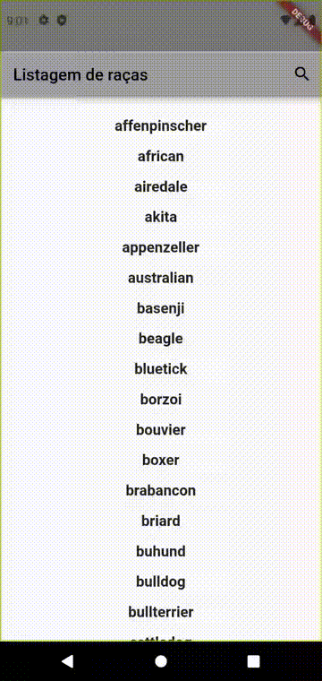

Barra de buscas e consulta a API com Flutter

<abbr title="muito grande; nem li">mg;nl</abbr>: Tutorial para criar um app em flutter que realiza requisições http numa API e filtra o resultado usando uma barra de busca.

Então essa semana eu comecei a aprender desenvolvimento de apps em Flutter.

Duas questões importantes em qualquer aplicativo, web ou mobile, é a possibilidade de acessar dados remotos, comumente em 
formato JSON, e disponibilizar ao usuário uma busca, por nome ou palavras-chave.

Dando uma procurada na net encontrei [este artigo](https://medium.com/flutter-community/parsing-complex-json-in-flutter-747c46655f51), com uma proposta
muito boa: ele ensina a criar uma barra de busca, de uma fonte remota, usando as ferramentas incluídas no pacote básico do Flutter.  

O artigo é um pouco datado (escrito ali por 2018) e utiliza algumas ferramentas já deprecadas.

Neste post, vou analisar o processo do autor enquanto migro sua aplicação para a versão atual do Flutter \(em janeiro/2022\).

Vou partir do princípio de que você já tem o android studio instalado, com uma VM de um celular ou tablet, como o pixel X3, por exemplo.

Caso você tenha dúvidas de como chegar nesse passo, recomendo [get-started](https://docs.flutter.dev/get-started/codelab) do site do Flutter, mas a versão rápida é:

        flutter create barra_de_buscas

E substituir o código no arquivo _lib/main_ pelo que está na seção abaixo.

O código completo pode ser consultado [neste gist](https://gist.github.com/guites/3d799bf707e9eaf17808382a0fecce04). Ali tambem tem as alterações necessárias no arquivo AndroidManifest.xml e pubspec.yaml .

## Overview do app

Abaixo uma prévia do app funcionando:

Nós iremos criar um StatefulWidget, que funcionará como uma página, que vai ter dentro dele tanto a barra de busca quanto a lista com os resultados.

Ele precisa ser Stateful, pois terá seu estado atualizado baseado nos valores digitados na barra, que irão por sua vez atualizar a listagem, utilizando o método `setState()`.

Antes de atualizarmos o estado, precisamos realizar uma requisição na API remota. Os dados recebidos serão tratados, e então passados para a listagem.

A API utilizada é a [Dog API](https://dog.ceo/dog-api/documentation/), que disponibiliza acesso a um banco de dados de raças e subraças de cachorro, cada uma com uma lista de imagens representativa.

## Inicio do projeto e instalação de dependencias.

Você pode iniciar criando um projeto em Flutter no android studio, ou copiar o código abaixo.

Basicamente, removemos todos os comentários e o contador, e alteramos o widget MyHomePage para um novo SearchPage. Lembre-se de alterar também o \_MyHomePageState para \_SearchPageState.

        // Ponto de partida do app, em lib/main.dart

        import 'package:flutter/material.dart';

        void main() {
          runApp(const MyApp());
        }

        class MyApp extends StatelessWidget {
          const MyApp({Key? key}) : super(key: key);
          @override
          Widget build(BuildContext context) {
            return MaterialApp(
              title: 'Flutter Searchbar Http',
              theme: ThemeData(
                primarySwatch: Colors.grey
              ),
              home: const SearchPage(title: 'Flutter search bar!'),
            );
          }
        }

        class SearchPage extends StatefulWidget {
          const SearchPage({Key? key, required this.title}) : super(key: key);
          final String title;

          @override
          _SearchPageState createState() => _SearchPageState();
        }

        class _SearchPageState extends State<SearchPage> {
          @override
          Widget build(BuildContext context) {
            return Scaffold(
              appBar: AppBar(
                title: Text(widget.title),
              ),
              body: const Center(
                child: Text('Meu app com barra de busca.'),
              )
            );
          }
        }

Para realizar as requisições http, precisamos de uma biblioteca que disponibilize essas funcionalidades.

A extensão mais comum pra requisições http, em 2022, é o [http.dart](https://pub.dev/packages/http/install).

Para instalá-la, são três passos.

1. Adicionar a pacote no arquivo `pubspec.yaml`. Deve ficar da seguinte forma:

        dependencies:
            flutter:
                sdk: flutter
            http: ^0.13.4 // ADICIONAR

Usando o android studio, você pode clicar no botão "Pub get" para baixar a extensão.

2. Adicionar uma permissão para o aplicativo realizar requisições http.

No `AndroidManifest.xml` do seu projeto, adicione a seguinte linha, logo abaixo da abertura da tag xml:

        <manifest xmlns:android="http://schemas.android.com/apk/res/android"
            package="com.example.searchbar_from_scratch">
            <!-- Required to fetch data from the internet. -->             // ADICIONAR
            <uses-permission android:name="android.permission.INTERNET" /> // ADICIONAR

3. Importar bibliotecas em `main.dart`. 

As importações são feitas nas primeiras linhas do arquivo:

        import 'dart:convert';                     // ADICIONAR
        import 'dart:async';                       // ADICIONAR
        import 'package:flutter/material.dart';
        import 'package:http/http.dart' as http;   // ADICIONAR

### Buscando dados na API

Vamos mostrar uma listagem das raças, disponíveis no endpoint 'https://dog.ceo/api/breeds/list/all' . O formato do JSON recebido é o seguinte:

        {
            "message":{
                "affenpinscher":[],
                "african":[],
                "airedale":[],
                "akita":[],
                "appenzeller":[],
                "australian":[
                    "shepherd"
                ],
                "basenji":[],
                "bulldog":[
                    "boston",
                    "english",
                    "french"
                ],
            "status":"success"
        }

Os dados que queremos estão dentro da propriedade "message". Repare que o JSON tem um formato não muito usual: o nome da raça é a propriedade do objeto. Caso existam "subraças",
elas são mostradas como o valor da propriedade, em formato de lista \(array\).

Graças ao pacote http, podemos criar uma função que busque esses dados.

O valor de retorno é uma classe `Future`. Essa classe é utilizada em qualquer operação assíncrona.

Como os valores não estarão disponíveis imediatamente \(existe uma demora entre realizar a requisição, o processamento no servidor remoto, e o recebimento dos dados no app\),
essa classe nos permite gerar diferentes layouts baseados na situação atual da requisição: podemos colocar um loader enquanto ela está carregando, um aviso caso ocorra um erro, etc.

A função abaixo pode ser colocada no próprio arquivo main.

        Future<dynamic> fetchBreeds() async {
          final response =
              await http.get(Uri.parse('https://dog.ceo/api/breeds/list/all'));
          if (response.statusCode == 200) {
                var responseObject = jsonDecode(response.body)['message'];
                return responseObject;
          }
          // Joga uma exceção caso o status não seja http 200
          throw Exception('Erro ao carregar listagem de raças.');
        }

Repare que definimos o tipo do retorno como `<dynamic>`. Isto é porque ainda não decidimos como vamos lidar com o resultado. O valor de `responseObject` que recebemos é no formato:

Repare que o formato `chave => valor` persiste. O tipo do objeto é um [LinkedHashMap](https://api.dart.dev/stable/2.15.1/dart-collection/LinkedHashMap-class.html). Para facilitar 
nossas operações, vamos transformá-lo numa lista contendo tanto o nome da propriedade \(que representa a raça\) quanto seu valor \(que é a listagem de subraças, quando existir\).

Para isso, utilizamos os seguintes métodos:

          if (response.statusCode == 200) {
                var responseObject = jsonDecode(response.body)['message'].entries.toList(); // ALTERAR
                return responseObject;
          }

O valor de `responseObject` vai ficar no formato:

Repare que o tipo do resultado mudou para `_GrowableList`, o que nos permite usar os métodos necessários para filtrar os resultados.

#### Criando um modelo para os dados da API - Lista de Raças

Até agora, definimos o tipo do resultado da requisição como `<dynamic>`. Isso permite que qualquer tipo de valor seja utilizado, estruturado de qualquer forma.
Com isso perdemos alguns dos [benefícios da linguagem Dart](https://dart.dev/guides/language/type-system), que não consegue verificar se os dados passados
estão de acordo com o esperado.

Por isso, vamos definir duas classes, uma que recebe uma listagem de raças \(BreedsList\) e uma que recebe uma única raça \(Breed\).

        class BreedsList {
          final List<Breed> breeds;
          BreedsList({
            required this.breeds,
          });
          factory BreedsList.fromJson(List<MapEntry<String, dynamic>> parsedJson) {
            List<Breed> breeds = <Breed>[];
            breeds = parsedJson.map((i) => Breed.fromJson(i)).toList();
            return BreedsList(breeds: breeds);
          }
        }

Esta classe, `BreedsList` representa a listagem que estamos recebendo da requisição http.

Sua propriedade `breeds` é uma lista de objetos `Breed`, que vamos definir em seguida.

Criamos também para essa classe um método `fromJson`, que recebe uma Lista de "MapEntries". Veja \(na Imagem 2\) que, ao transformarmos nosso objeto com os métodos `.entries.toList()`, é exatamente
este o formato de cada item da lista:

    5 = {MapEntry}MapEntry(australian: [sheperd]
        key = "australian"
        value={_GrowableList} size = 1
            0 = "sheperd"

O primeiro valor do MapEntry é o nome da raça, por isso, uma `String`. O segundo valor é uma `List`, no exemplo acima, mas poderia ser um número, string, boolean, etc, por isso `dynamic`.

#### Criando um modelo para os dados da API - Raça

Cada Raça pode ser definida como contendo um nome e uma listagem de subraças.

        class Breed {
          final String name;
          final List<dynamic> subBreeds;

          const Breed({
            required this.name,
            required this.subBreeds,
          });

          factory Breed.fromJson(json) {
            return Breed(
              name: json.key,
              subBreeds: json.value,
            );
          }
        }

Aqui também criamos um método `fromJson`, que pega, do json decodificado que nos é passado, o nome da propriedade \(lembra que o nome da raça é a propriedade do objeto, no valor que recebemos da API?\) e o seu valor \(as subraças\), passando eles como propriedades para cada objeto `Breed`.

O método `fromJson` da classe `BreedList` transforma todos eles em uma lista, usando o método `toList()`.

#### Ajustando o retorno da função fetchBreeds()

Agora que definimos as classes utilizadas de modelo para os dados recebidos da API, podemos alterar o tipo do retorno da função `fetchBreeds()`.

        Future<BreedsList> fetchBreeds() async { // ALTERAR
          final response =
          await http.get(Uri.parse('https://dog.ceo/api/breeds/list/all'));
          if (response.statusCode == 200) {
            var responseObject = jsonDecode(response.body)['message'].entries.toList(); 
            return BreedsList.fromJson(                                                 // ALTERAR
                responseObject                                                          // ALTERAR
            );
          }
          // Joga uma exceção caso o status não seja http 200
          throw Exception('Erro ao carregar listagem de raças.');
        }

### Disponibilizando dados ao carregar a home do app

Quando o usuário abrir o app, vamos carregar a página "SearchPage" por padrão. Precisamos realizar uma requisição para a nossa API e mostrar uma listagem
dos resultados.

O Flutter disponibiliza um método `initState()` que é disparado toda vez que um widget é carregado. Vamos adicioná-lo na nossa página.

        class _SearchPageState extends State<SearchPage> {
            late Future<BreedsList> futureBreeds; // ADICIONAR

            @override                             // ADICIONAR
            void initState() {                    // ADICIONAR
              super.initState();                  // ADICIONAR
              futureBreeds = fetchBreeds();       // ADICIONAR
            }                                     // ADICIONAR

O modificador `late` é usado para definir variáveis não nulas que serão inicializadas após sua declaração. Fazemos isso para manter `futureBreeds` no escopo da nossa página.

#### Renderizando a lista original

Como sabemos o formato de nossos dados, podemos mostrá-los para o usuário. Optei por um formato de lista.

Uma particularidade das requisições http é o Widget `FutureBuilder`. Ele nos permite renderizar blocos diferentes dependendo do estado da requisição.

Este Widget define o estado da requisição baseado numa variável que ele disponibiliza, a `snapshot`.

Vamos modificar o `body` do método `build`, no nosso `_SearchPageState`.

        @override
        Widget build(BuildContext context) {
          return Scaffold(
              appBar: AppBar(
                title: Text(widget.title),
              ),
              body: FutureBuilder<BreedsList>(                                     // ALTERAR
                    future: futureBreeds,                                          // ADICIONAR
                    builder: (context, snapshot) {                                 // ADICIONAR
                      if (snapshot.hasData) {                                      // ADICIONAR
                        return _buildListOfBreeds(snapshot.data!.breeds);          // ADICIONAR
                      } else if (snapshot.hasError) {                              // ADICIONAR
                        return Text('${snapshot.error}');                          // ADICIONAR
                      }                                                            // ADICIONAR
                      return const Center(                                         // ADICIONAR
                        child: CircularProgressIndicator(),                        // ADICIONAR
                      );                                                           // ADICIONAR
                    }),                                                            // ADICIONAR
          );
        }

O _tipo_ passado no Widget `FutureBuilder` é uma `<BreedsList>`, exatamente o retorno do nosso método `fetchBreeds()`.

A propriedade `future: futureBreeds` indica que qual variável será observada para definir o estado do snapshot utilizado no método
builder.

Quando ela tiver dados, ou seja, tiver concluído a requisição, iremos chamar a função `_buildListOfBreeds(snapshot.data!.breeds)`, 
que será definida a seguir.

Caso não tiver dados, verificamos se a requisição retornou um erro. Neste caso, ele será printado na tela. O ideal é colocar uma mensagem 
customizada, mas como estamos depurando o app, pode nos ajudar.

Caso nenhuma das verificações acima passe, vamos renderizar um `CircularProgressIndicator()` centralizado, que é um loader padrão do Flutter.

#### Criando o Widget `_buildListOfBreeds`

Você pode colocar o código abaixo antes da chamada ao método build na classe `_SearchPageState`.

        Widget _buildListOfBreeds(List<Breed> breedList) {
          return ListView.builder(
            padding: const EdgeInsets.all(16.0),
            itemCount: breedList.length,
            itemBuilder: (context, i) {
              return Column(children: [
                Text(breedList[i].name,
                    style:
                        const TextStyle(fontWeight: FontWeight.bold, fontSize: 18.0)),
                const Divider()
              ]);
            },
          );
        }

Com isso, a aparência do nosso app deve estar conforme a imagem abaixo.

Talvez seja preciso realizar um _hot restart_, ou reiniciar o aplicativo, caso você receba um erro de variáveis 
não iniciadas.

### Definindo as variáveis necessárias

Nosso widget precisa guardar alguns dados, e para isso vamos definir algumas variáveis logo no início da classe \_SearchPageState.

        class _SearchPageState extends State<SearchPage> {
          late Future<BreedsList> futureBreeds;

          /// Define o ícone inicial usado na barra de busca
          IconData _searchIcon = Icons.search;                                                               // ADICIONAR

          /// Define o título inicial da página
          Widget _appBarTitle = const Text('Listagem de raças');                                             // ADICIONAR

          /// Essa variável vai guardar o valor digitado na barra de busca
          String _searchText = "";                                                                           // ADICIONAR

          /// Esta variável vai guardar os valores filtrados, que devemos mostrar ao usuário na listagem
          List<Breed> _filteredBreeds = [];                                                                  // ADICIONAR

          @override
          void initState() {
              super.initState();
              futureBreeds = fetchBreeds();

Nas próximas seções vamos verificar a utilidade de cada variável definida.

### Adicionando a barra de busca no cabeçalho

O local onde o usuário irá digitar será o próprio cabeçalho do app.

Cada página possui uma propriedade `AppBar`, onde podemos definir o título da página e colocar também alguns botões \(chamados actions\).

Começaremos com um botão que permite ao usuário abrir a barra de busca.

Adicione a seguinte função dentro da classe `_SearchPageState`.

        void _searchPressed() {
          setState(() {
            if (_searchIcon == Icons.search) {
              _searchIcon = Icons.close;
              /// Altera o título, inicialmente um widget de texto, para um TextField
              _appBarTitle = const TextField(
                decoration: InputDecoration(
                    prefixIcon: Icon(Icons.search), hintText: 'Busque por raças...'),
              );
            } else {
              _searchIcon = Icons.search;
              /// Altera o título novamente para um widget de texto
              _appBarTitle = const Text('Listagem de raças');
            }
          });
        }

Essa função verifica qual o ícone atual e, baseado no seu `IconData` \(propriedade que define a imagem do ícone\), altera tanto o 
ícone quanto o título do app.

Para que ela seja executada, precisamos ativá-la na propriedade `onPressed` do nosso ícone inicial.

Vamos alterar o método `build` da nossa `_SearchPageState`.

        @override
          Widget build(BuildContext context) {
            return Scaffold(
                appBar: AppBar(
                  title: _appBarTitle,              // ALTERAR
                  actions: <Widget>[                // ADICIONAR
                    IconButton(                     // ADICIONAR
                      onPressed: _searchPressed,    // ADICIONAR
                      icon: Icon(_searchIcon),      // ADICIONAR
                    )                               // ADICIONAR
                  ],                                // ADICIONAR
                ),
                body: FutureBuilder<BreedsList>(
                  future: futureBreeds,
                  builder: (context, snapshot) {
                    if (snapshot.hasData) {
                      return _buildListOfBreeds(snapshot.data!.breeds);
                    } else if (snapshot.hasError) {
                      return Text('${snapshot.error}');
                    }
                    return const Center(
                      child: CircularProgressIndicator(),
                    );
                  },
                ),
            );
          }

Adiconar uma `action` na nossa `AppBar` cria o ícone com a funcionalidade definida em `onPressed`.

Apertar o botão agora deve alternar entre o campo de busca, com o botão para fechar, e o ícone da lupa.

Precisamos salvar o texto digitado pelo usuário para utilizá-lo no filtro.

### Acessando os valores digitados na barra de busca

Para acessar o texto digitado, utilizamos a propriedade `onChanged` do `TextField`.

Dessa forma, podemos atualizar a variável `_searchText` cada vez que o valor do campo de busca for alterado.

        void _searchPressed() {
          setState(() {
            if (_searchIcon == Icons.search) {
              _searchIcon = Icons.close;
              /// Altera o título, inicialmente um widget de texto, para um TextField
              _appBarTitle = TextField(            // ALTERAR
                onChanged: (text) {                // ADICIONAR
                  setState(() {                    // ADICIONAR
                    _searchText = text;            // ADICIONAR
                  });                              // ADICIONAR
                },                                 // ADICIONAR
                decoration: const InputDecoration( // ALTERAR
                    prefixIcon: Icon(Icons.search), hintText: 'Busque por raças...'),
              );
            } else {
              _searchIcon = Icons.search;
              _appBarTitle = const Text('Listagem de raças');
              _searchText = "";                    // ADICIONAR
            }
          });
        }

Repare que no bloco `else` estamos zerando o valor da `_searchText`. Isso significa que quando o usuário fechar a barra de busca,
a listagem descarta o filtro.

### Filtrando a listagem de raças

Precisamos de um método que, para qualquer string, encontre os nomes de raça, dentro da nossa listagem, que possuem esta string.

Adicione a função abaixo dentro da `_SearchPageState`.

        List<Breed> _applySearchFilter(List<Breed> breeds) {
          List<Breed> _filtered = [];
          for (var i = 0; i < breeds.length; i++) {
            if (breeds[i].name.contains(_searchText.toLowerCase())) {
              _filtered.add(breeds[i]);
            }
          }
          return _filtered;
        }

Podemos utilizar o fato das nossas `Breed`s estarem em formato de lista para realizar um for loop simples.

Agora, precisamos utilizar esta função na nossa lista original, e passar o resultado como argumento dentro do bloco `FutureBuilder`.

        body: FutureBuilder<BreedsList>(
          future: futureBreeds,
          builder: (context, snapshot) {
            if (snapshot.hasData) {
              final _filteredList = _applySearchFilter(snapshot.data!.breeds);  // ADICIONAR
              if (_filteredList.isEmpty) {                                      // ADICIONAR
                return const Center(child: Text("Nenhuma raça encontrada!"));   // ADICIONAR
              }                                                                 // ADICIONAR
              return _buildListOfBreeds(_filteredList);                         // ALTERAR
            } else if (snapshot.hasError) {
              return Text('${snapshot.error}');
            }
            return const Center(
              child: CircularProgressIndicator(),
            );
          },
        ),

Adicionamos também um aviso, caso o filtro não retorne nenhum resultado.

**Pronto!** Temos um filtro funcional.

Fontes:

- <https://dev.to/pktintali/late-variables-in-dart-dart-learning-series-1-2opf>
- <https://dart.dev/guides/language/type-system>
- <https://api.dart.dev/stable/2.15.1/dart-core/Map-class.html>
- <https://api.dart.dev/stable/2.15.1/dart-collection/LinkedHashMap-class.html>
- <https://docs.flutter.dev/cookbook/forms/text-field-changes#1-supply-an-onchanged-callback-to-a-textfield-or-a-textformfield>

Tags: flutter, dart
