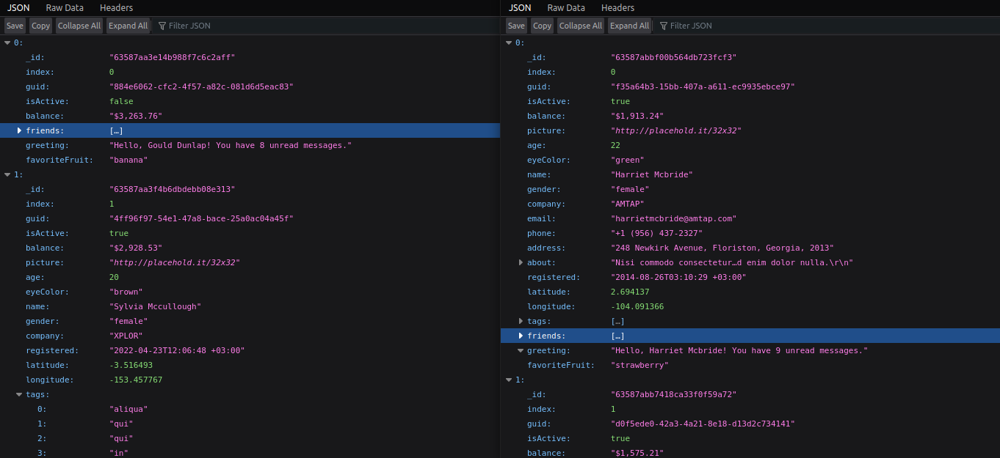
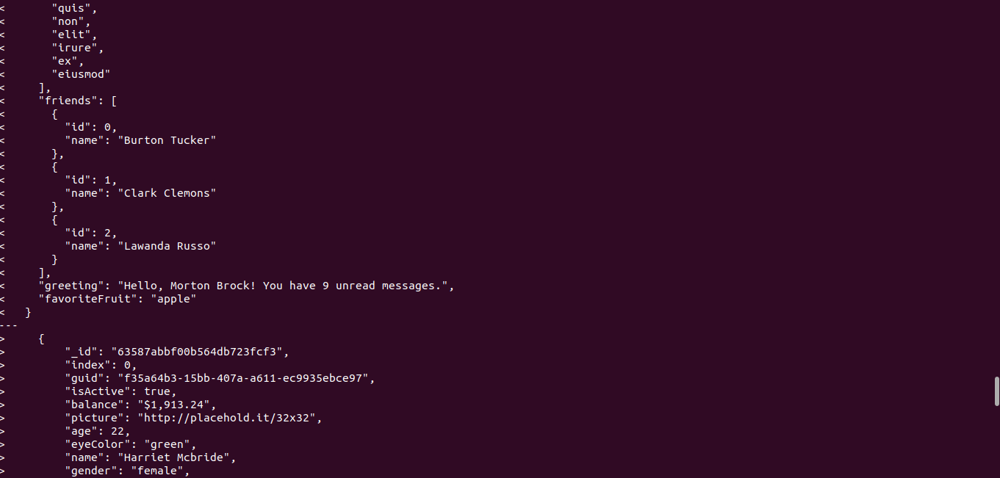
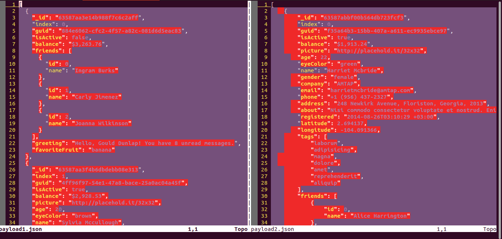
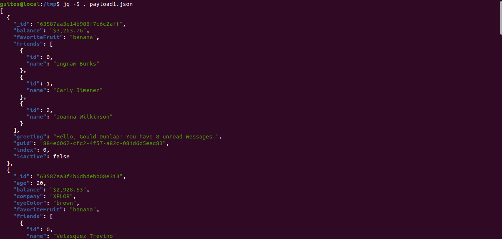
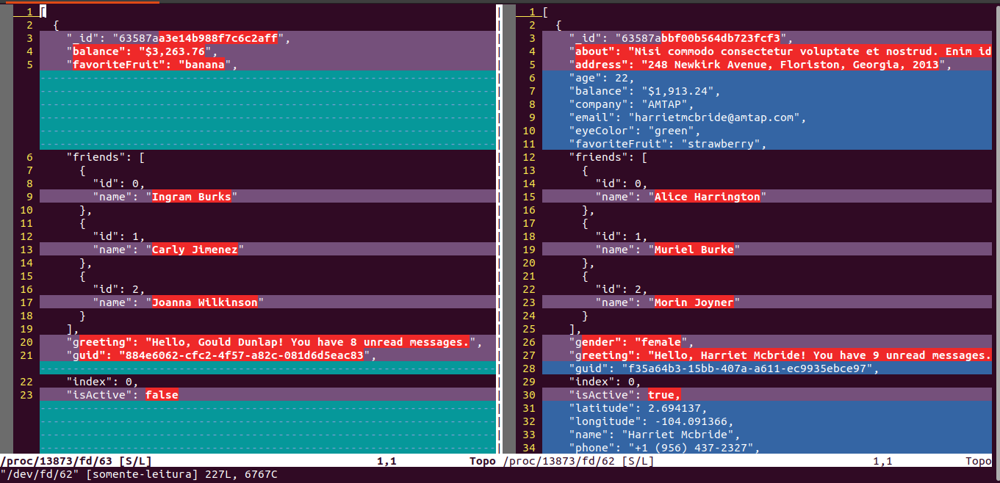
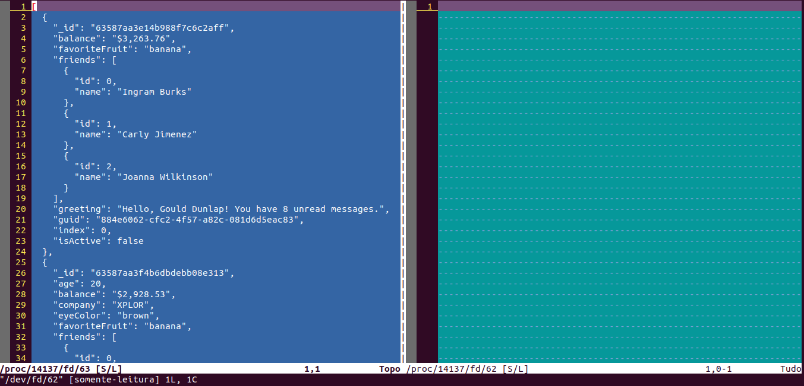

Comparando json na linha de comando

<abbr title="muito grande;nem li">mg;nl</abbr>: vamos usar o [vimdiff](https://vimdoc.sourceforge.net/htmldoc/diff.html) e o [jq](https://stedolan.github.io/jq/) para comparar arquivos json independente da formatação.

Comparar arquivos json parecidos pode ser complicado. Muitas vezes os arquivos foram formatados com espaçamentos diferentes, ou a diferença não ocorre no mesmo nível hierarquico.

Vamos criar um script simples pra comparar arquivos json diretamente pelo terminal, usando o programa `jq` e o `vimdiff`.

Vamos ver também como preparar um script bash pra lidar com erros conhecidos, como arquivos com json inválido ou de outro formato.

<aside>Os exemplos usados foram gerados usando <https://json-generator.com></aside>

## Payloads de exemplo

Vamos testar a comparação de dois arquivos json, [payload1.json](./imgs/comparando-json-na-linha-de-comando/payload1.json) e [payload2.json](./imgs/comparando-json-na-linha-de-comando/payload2.json).

<aside>Clique no nome dos arquivos pra fazer download.</aside>

## Comparando no olho

Você pode fazer do jeito manual, abrindo seus arquivos e comparando no olho:

        # substitua firefox pelo seu visualizador/editor favorito

        firefox payload1.json payload2.json

Logo de cara, algumas dúvidas surgem: quais chaves o primeiro arquivo tem, que o segundo não? Em quais índices do array?

Vamos utilizar um programa mais propício.

## Programas de comparação de texto

Que tal usar o `diff`?

        diff payload1.json payload2.json

Opa, parece que todas as linhas são diferentes?

Vamos investigar com `vimdiff`

        vimdiff payload1.json payload2.json

Ah é, o espaçamento é diferente nos dois arquivos...

<aside>Você precisa escrever `:qa` pra fechar o vimdiff!</aside>

## Ajustando a formatação

Vamos utilizar o [jq](https://stedolan.github.io/jq/), um utilitário que permite manipular arquivos json pela linha de comandos.

        sudo apt-get install jq

Ele tem uma opção que resolve o problema das chaves faltantes, `-S` ou `--sort-keys`, que ordena as propriedades de todos os objetos.

        jq -S . payload1.json

Repare que ele também ajusta os espaçamentos.

## Juntando tudo em `jsondiff`

Vamos criar uma função que une a formatação de `jq` com a comparação de `vimdiff`, usando a [substituição de comandos](https://www.gnu.org/software/bash/manual/html_node/Command-Substitution.html) do bash.

        vimdiff <(jq -S . payload1.json) <(jq -S . payload2.json)

Bem melhor!

Podemos generalizar o comando em uma função. Você pode adicioná-la diretamente no seu arquivo `~/.bash_aliases`.

        function jsondiff() {
            vimdiff <(jq -S . $1) <(jq -S . $2)
        }
        alias ,jsondiff=jsondiff

Onde `$1` e `$2` fazem referência ao primeiro e segundo argumentos passados na função, respectivamente.

Depois de editar o `~/.bash_aliases`, lembre de rodar

        source ~/.bash_aliases

Pra alteração surtir efeito na sessão atual.

Você pode chamar a nova função com

        ,jsondiff payload1.json payload2.json

<aside>A vírgula antes do nome da função é opcional, mas é uma forma fácil de lembrar o nome das suas funções customizadas. Basta digitar "," no terminal e apertar tab duas vezes :-) . </aside>

## Evitando erros em jsondiff

No formato atual, caso você passe como argumento um arquivo com json inválido \(ou arquivo de outro formato\), erros estranhos podem ocorrer.

Salve o json abaixo num arquivo chamado [invalid.json](./imgs/comparando-json-na-linha-de-comando/invalid.json):

        [
          {
            "_id": "63587aa3e14b988f7c6c2aff",
            "index": 0,
            "guid": "884e6062-cfc2-4f57-a82c-081d6d5eac83",
            "isActive": false,
          }
        ]

<aside>O formato json não permite a vírgula à direita na última propriedade de um objeto.</aside>

E tente utilizá-lo como parâmetro no `jsondiff`

        ,jsondiff payload1.json invalid.json

Repare que a tela da direita está vazia.

Se você tentar utilizar o `jq` diretamente no invalid.json,

        jq -S . invalid.json

Vai ver o seguinte output:

        parse error: Expected another key-value pair at line 7, column 3

Por sorte, o `jq` respeita a tradição unix de reservar o código de saída 0 para programas que rodarem com sucesso.

Um código de saída diferente de 0, portanto, indica que ocorreu um erro. No nosso caso, qualquer tipo de erro deve impedir que o programa prossiga.

Vamos criar um teste, que vai ser rodado antes da lógica do `jsondiff`.

Primeiro, rodamos o `jq`:

        jq . invalid.json >/dev/null 2>&1

<aside>A parte `>/dev/null 2>&1` tem duas funções: `2>&1` redireciona as saídas de erro pro canal normal \(stderr into stdout\), e `>dev/null` descarta toda a saída do canal normal. Basicamente, jogamos fora qualquer output da função.</aside>

Depois, verificamos o código de saída, utilizando a variável reservada `$?`. Experimenta printá-la:

        jq . invalid.json >/dev/null 2>&1
        echo $?

Verifique um output no formato abaixo:

        guites@local:/tmp$ jq -S . invalid.json
        parse error: Expected another key-value pair at line 7, column 3
        guites@local:/tmp$ echo $?
        4 # <!-- código de erro diferente de 0 !

Vamos colocar esse teste num bloco `if else`:

    if ! jq . $1 >/dev/null 2>&1; then
        echo "$1 contains invalid json data."
    fi

<aside>No mundo unix, um output 0 é considerado `true`, enquanto qualquer outro número é visto como `false`.</aside>

Podemos encapsular esse teste em uma função separada

        function validatejson() {
            if ! jq . $1 >/dev/null 2>&1; then
                echo "$1 contains invalid json data."
                return 1
            fi
            return 0
        }

## `jsondiff` à prova de erros

Utilizando a verificação, vamos adaptar nosso método principal, o `jsondiff`, diretamente no arquivo `~/.bash_aliases`

        function validatejson() {
            if ! jq . $1 >/dev/null 2>&1; then
                echo "$1 contains invalid json data."
                return 1
            fi
            return 0
        }

        function jsondiff() {
            validatejson $1 || return 1
            validatejson $2 || return 1
            vimdiff <(jq -S . $1) <(jq -S . $2)
        }

        alias ,jsondiff=jsondiff

<aside>O uso do `if ! <comando>` é uma forma enxuta de verificar se o código de saída de um comando é diferente de zero.</aside>

Caso o arquivo json passado de argumento seja inválido, o método `validatejson()` vai retornar 1, que é considerado um valor falso, e caímos no lado direito dos operadores OR \(`||`\) utilizados nas duas primeiras linhas da função `jsondiff`.

<aside>Lembre de rodar `source ~/.bash_aliases` sempre que modificar o arquivo.</aside>

O `return 1` cumpre dois objetivos: finaliza a função antes de entrarmos na parte principal, e define o código de saída, para mantermos o padrão unix.

Vamos testar:

        ,jsondiff payload1.json invalid.json
        echo $?

Verifique o output no formato:

        guites@local:/tmp$ ,jsondiff payload1.json invalid.json
        invalid.json contains invalid json data.
        guites@local:/tmp$ echo $?
        1

Abraço!

## Referências

1. <https://stackoverflow.com/a/46955018/14427854>
2. <https://stackoverflow.com/a/37175540/14427854>
3. <https://www.jsondiff.com/>

Tags: json, vimdiff, cli, bash
