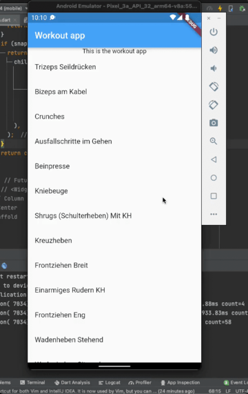

Criando um app com Flutter e sqlite

<abbr title="muito grande; nem li">mg;nl</abbr>: neste post vamos configurar um projeto em flutter utilizando sqlite3 e models criados utilizando geração de código. Vamos verificar também como exibir esses valores utilizando o Widget FutureBuilder.

Iniciei o desenvolvimento de um app de registro de exercícios.

Já existem muitos aplicativos ótimos nesse ambito, e muito mais completos, mas nenhum, na minha opinião, atingiu os 3 objetivos principais que eu buscava:

1. interface simples e leve: um clique tem que me levar direto pra parte principal, sem login, sem configurações. Apenas um clique, escolher o exercício, e começar a registrar.

2. Registrar a quantidade de sets e o tempo de descanso: eu começo um exercício, faço um set e, enquanto descanso, penso na vida. Já se passaram 30 segundos, 1 minuto ou 3 minutos? Quantos sets eu já fiz, 2 ou 3?

3. Funcionar sem internet. Eu costumo revisar meu treino enquanto caminho pra academia, e não gosto de ficar à merce da qualidade de recepção da 4g.

Optei por desenvolver em flutter, assim consigo gerar um apk instalável no meu celular, e também hospedar a versão web pra mostrar pras pessoas.

Neste post vou falar um pouco sobre integrar o uso de bancos de dado, em sqlite3, para aplicativos Flutter.

O banco de dados de exercícios foi adaptado do projeto [wger](https://github.com/wger-project/wger).

O código deste post pode ser encontrado no [branch main deste repositório](https://github.com/guites/flutter-gym-app/tree/main).

## Overview do projeto

Neste post vamos realizar as seguintes atividades, com o objetivo de, ao final, ter um app no estado abaixo:

1. Instalar o projeto wger e extrair as informações que precisamos do seu banco de dados.
2. Configurar um projeto em Flutter utilizando sqlite.
3. Desenvolver as classes necessárias para interagir com o banco de dados utilizando o plugin [built\_values](https://pub.dev/packages/built_value).
4. Gerar uma lista com os resultados puxados do banco.

## Instalando o projeto e extraindo o banco de dados

Vamos utilizar como ponto de partida o banco de dados do projeto wger.

**Você pode fazer o download dos bancos de dados e pular esta etapa**:

1. [banco completo do projeto wger](./imgs/criando-um-app-de-exercicios-com-flutter-e-sqlite/full_database.sqlite)
2. [banco com apenas as tabelas de exercício/linguagens](./imgs/criando-um-app-de-exercicios-com-flutter-e-sqlite/exercises_only.sqlite3)

Os passos para instalação do projeto no local podem ser vistos [aqui](https://wger.readthedocs.io/en/latest/development.html).

De forma rápida:

    cd ~ && mkdir wger
    python3 -m venv venv-wger
    source venv-wger/bin/activate
    git clone https://github.com/wger-project/wger.git src
    cd src
    pip install -r requirements_dev.txt
    pip install -e .
    wger create-settings
    wger bootstrap

Ao instalar o projeto no meu mac me deparei com o seguinte erro no último passo:

    ImportError: dlopen(~/wger/venv-wger/lib/python3.9/site-packages/reportlab/graphics/_renderPM.cpython-39-darwin.so, 0x0002): symbol not found in flat namespace '_FT_Done_Face'

De acordo com [este post no stackoverflow](https://stackoverflow.com/questions/69973873/symbol-not-found-in-flat-namespace-ft-done-face-from-reportlab-with-python3) o erro ocorre em macs com chip ARM. 

Você pode resolver reinstalando o pacote \(reportlab.py\):

    pip install reportlab --force-reinstall --no-cache-dir --global-option=build_ext

Depois podemos finalizar a instalação

    wger load-online-fixtures

Você pode explorar o aplicativo para entender melhor como ele funciona. Por enquanto, vou focar em extrair as tabelas necessários do banco de dados gerado pela instalação.

### Criando um novo banco de dados sqlite3 com as tabelas necessárias

Certifique-se de que você tem o sqlite3 instalado.

O wger gera durante a instalação um banco de dados `database.sqlite` . Vamos criar um novo banco, `exercises\_only`, que vai conter apenas as tabelas com os dados dos exercícios.

    sqlite3 exercises_only
    ATTACH 'database.sqlite' AS full_database;
    ATTACH 'exercises_only.sqlite3' AS exercises_only;
    CREATE TABLE IF NOT EXISTS exercises_only.exercises_exercise AS SELECT * FROM full_database.exercises_exercise;

Devido à forma como os dados estão organizados na tabela `exercises_exercise`, precisamos também da tabela `core_language`.

    CREATE TABLE IF NOT EXISTS exercises_only.core_language AS SELECT * FROM full_database.core_language

Pronto! Com estes dados, podemos começar nosso aplicativo em Flutter.

## Iniciando o projeto em Flutter

Vou partir do princípio de que você já tem o android studio instalado, com uma VM de um celular ou tablet, como o pixel 3, por exemplo.

Caso você tenha dúvidas de como chegar nesse passo, recomendo o  [get-started](https://docs.flutter.dev/get-started/codelab) do site do Flutter, mas a versão rápida é:

    flutter create workout_app

Nosso ponto de partida, em `main.dart` é o abaixo:

    import 'package:flutter/material.dart';
    import 'dart:async';

    import 'package:path/path.dart';
    import 'package:sqflite/sqflite.dart';

    void main() {
      runApp(const MyApp());
    }

    class MyApp extends StatelessWidget {
      const MyApp({Key? key}) : super(key: key);

      // This widget is the root of your application.
      @override
      Widget build(BuildContext context) {
        return MaterialApp(
          title: 'Workout app',
          theme: ThemeData(
            primarySwatch: Colors.blue,
          ),
          home: const MyHomePage(title: 'Workout app'),
        );
      }
    }

    class MyHomePage extends StatefulWidget {
      const MyHomePage({Key? key, required this.title}) : super(key: key);

      final String title;

      @override
      State<MyHomePage> createState() => _MyHomePageState();
    }

    class _MyHomePageState extends State<MyHomePage> {

      @override
      Widget build(BuildContext context) {
        return Scaffold(
          appBar: AppBar(
            title: Text(widget.title),
          ),
          body: Center(
            child: Column(
              mainAxisAlignment: MainAxisAlignment.center,
              children: const <Widget>[
                Text(
                  'This is the workout app',
                ),
              ],
            ),
          ),
        );
      }
    }

## Definindo os modelos para interação com o banco

Nossa tabela principal, `exercises`, tem o seguinte _schema_:

    "id" integer NOT NULL PRIMARY KEY AUTOINCREMENT,
    "license_author" varchar(50) NULL,
    "status" varchar(2) NOT NULL,
    "description" text NOT NULL,
    "name" varchar(200) NOT NULL,
    "creation_date" date NULL,
    "language_id" integer NOT NULL REFERENCES "core_language" ("id") DEFERRABLE INITIALLY DEFERRED,
    "license_id" integer NOT NULL REFERENCES "core_license" ("id") DEFERRABLE INITIALLY DEFERRED,
    "uuid" char(32) NOT NULL,
    "name_original" varchar(200) NOT NULL,
    "exercise_base_id" integer NULL REFERENCES "exercises_exercisebase" ("id") DEFERRABLE INITIALLY DEFERRED

Nosso Model precisa refletir esta estrutura. Ao invés de criarmos as classes manualmente, como fizemos [neste post](https://guilhermegarcia.dev/blog/barra-de-buscas-e-consulta-a-api-com-flutter.html), vamos utilizar o plugin [built value](https://pub.dev/packages/built_value) que automatiza o processo.

Além da criação das classes, esse plugin também gera métodos para serialização e desserialização de JSON, cria métodos para comparação das classes e, em situações mais complexas, também lida com a hierarquia dos objetos..

Adicione no seu `pubspec.yaml`

    dependencies:
      flutter:
        sdk: flutter
      sqflite:
      path:
      built_value: ^8.1.4          // adicionar
      built_collection: ^5.1.1     // adicionar

    dev_dependencies:
      flutter_test:
        sdk: flutter
      flutter_lints: ^1.0.0
      build_runner: ^2.1.7           // adicionar
      built_value_generator: ^8.1.4  // adicionar

Depois, na raíz do seu projeto, rode um `flutter pub get`.

Crie um diretório `models` e, dentro dele, `exercise.dart`.

O plugin built\_value espera que você forneça as classes em um formato específico:

- elas devem ser [classes abstratas](https://flutterbyexample.com/lesson/abstract-classes-and-interfaces)

  ou seja, não podem ser instanciadas diretamente \(veja o item abaixo\), e suas propriedades e métodos são definidos por suas subclasses.

- elas precisam ter um método [Factory](https://stackoverflow.com/a/56107639), através do qual você instancia um novo objeto. 

  você chama a classe por este método e recebe uma subclasse, que é gerada pelo plugin.

- elas podem possuir um método `Serializer`

  que lida com a serialização de um objeto da classe em formato json e vice-e-versa.

Dentro do nosso arquivo `exercise.dart`, vamos colocar o seguinte código:

    import 'package:built_collection/built_collection.dart';
    import 'package:built_value/built_value.dart';
    import 'package:built_value/serializer.dart';

    part 'exercise.g.dart'; // (1)

    abstract class Exercise implements Built<Exercise, ExerciseBuilder> {
      int get id;
      String get license_author;
      String get status;
      String get description;
      String get name;
      String get creation_date;
      int get language_id;
      int get license_id;
      String get uuid;
      String get name_original;
      int get exercise_base_id;

      Exercise._();
      factory Exercise([void Function(ExerciseBuilder)? updates]) = _$Exercise; // (2)
      static Serializer<Exercise> get serializer => _$exerciseSerializer;
    }

Repare que estamos importando, em \(1\), um arquivo que ainda não existe \(exercise.dart\). Este arquivo será gerado através do built\_value.

Em \(2\) estamos definindo o método _Factory_ que será utilizado para instanciar os objetos através dos dados recebidos do banco.

Vamos criar também um arquivo responsável pela lógica da serialização, `serializers.dart`, também no diretório `models`.

    import 'package:built_collection/built_collection.dart';
    import 'package:built_value/built_value.dart';
    import 'package:built_value/standard_json_plugin.dart';
    import 'package:built_value/serializer.dart';
    import 'package:workout_app/models/exercise.dart';

    part 'serializers.g.dart';

    @SerializersFor([
      Exercise,
    ])
    final Serializers serializers = (_$serializers.toBuilder()..addPlugin(StandardJsonPlugin())).build();

Com isso pronto, podemos rodar, no terminal, na raíz do projeto, o comando:

    flutter packages pub run build_runner build

Esse comando vai gerar os arquivos `exercises.g.dart` e também `serializers.g.dart`. Você pode inspecioná-los \(o código é em dart\), e verificar os métodos criados para cada classe.

## Configurando o acesso ao banco de dados

Adicione as seguintes dependências no seu `pubspec.yaml`:

    dependencies:
      flutter:
        sdk: flutter
      sqflite:    // adicionar
      path:       // adicionar

Rode um `flutter pub get` na raíz do projeto para atualizar as dependências.

Agora, precisamos iniciar uma conexão com o banco de dados.

Vamos utilizar um padrão _singleton_, com o objetivo de manter uma unica conexão com o banco de dados, que será sempre reutilizada.

Crie um diretório `api`, que irá guardar os arquivos responsáveis por interagir com o banco de dados.

Dentro de `api`, crie o arquivo `database.dart`.

    import 'dart:io';

    import 'package:flutter/services.dart';
    import 'package:path/path.dart';
    import 'package:sqflite/sqflite.dart';

    class DB {
      static final DB _db = DB._internal();
      DB._internal();

      // este boolean previne a criação de multiplas instâncias de conexão com o banco de dados.
      bool initialized = false;
      static DB get instance => _db;
      static late Database _database;

      Future<Database> get database async {
        if (initialized) {
          return _database;
        }
        _database = await _init();
        initialized = true;
        return _database;
      }

      Future<Database> _init() async {
        var dbDir = await getDatabasesPath(); (1)
        var dbPath = join(dbDir, "app.sqlite"); (2)
        await deleteDatabase(dbPath); (3)

        ByteData data = await rootBundle.load("assets/exercises_only.sqlite3"); (4)
        List<int> bytes = data.buffer.asUint8List(data.offsetInBytes, data.lengthInBytes);
        await File(dbPath).writeAsBytes(bytes); (5)

        return await openDatabase(join(dbPath)); (6)

      }

    }

Atenção para o método `_init()`. Aqui consta a lógica para carregar nosso banco de dados existente dentro do app.

Em \(1\) carregamos na variável `dbDir` um caminho com permissão de escrita, definido pela aplicação.

Em \(2\) definimos o arquivo que será utilizado como banco de dados pela aplicação.

Em \(3\) deletamos qualquer valor existente no arquivo. Isso nos permite uma instalação limpa do nosso banco.

Em \(4\) carregamos o arquivo com o banco de dados que geramos lá no inicio. Repare que ele está num diretório chamado assets.

Você pode criá-lo dentro da raíz do aplicativo. A estrura deve ficar nesse formato:

    workout_app/
      android/
      assets/
        exercises_only.sqlite3
      build/
      ios/
      lib/
        main.dart
        models/
        api/
      ...
      etc

Com o arquivo no lugar correto, precisamos adicionar uma linha no nosso `pubspec.yaml`, para que o arquivo fique
disponível para a aplicação.

    flutter:
      uses-material-design: true
      assets:
        - assets/exercises_only.sqlite3 # ADICIONAR

Em \(5\), escrevemos o valor do arquivo `exercises_only.sqlite3` naquele outro que criamos, o `app.sqlite3`.

Em \(6\), agora que temos acesso ao arquivo com nosso banco, abrimos uma conexão com o sqlite.

## Realizando queries no banco

Agora podemos realizar requisições no banco e instanciar nossos objetos `Exercise` a partir dos resultados.

Dentro do diretório `api`, crie o arquivo `exercises.dart`.

    import 'package:workout_app/api/database.dart';
    import 'package:workout_app/models/exercise.dart';

    Future<List<Exercise>> exercises() async {
      final db = await DB.instance.database;

      final List<Map<String, dynamic>> maps = await db.query('exercises_exercise'); // (1)

      final List<Exercise> exercises = List.generate(maps.length, (index) {   // (2)
        return Exercise((b) => b   // (3)
          ..id = maps[index]['id']
          ..license_author = maps[index]['license_author']
          ..status = maps[index]['status']
          ..description = maps[index]['description]
          ..name = maps[index]['name']
          ..creation_date = maps[index]['creation_date']
          ..language_id = maps[index]['language_id']
          ..license_id = maps[index]['license_id']
          ..uuid = maps[index]['uuid']
          ..name_original = maps[index]['name_original']
          ..exercise_base_id = maps[index]['exercise_base_id']);
      });

      return exercises;

    }

Em \(1\) estamos rodando o equivalente a um `SELECT * FROM exercises_exercise`. Esses dados são retornados como um lista de maps.

Em \(2\) usando o método `generate` das listas para iterar ao longo do resultado.

Em \(3\) utilizamos o método `Factory` que definimos no nosso _model_ \(em `models/exercises.dart`\) para instanciar os objetos.

O método generate retorna uma lista, agora com seus itens tipados \(`<Exercise>`\).

## Renderizando os valores

Como nossa função `exercises` é assíncrona, vamos utilizar um `Widget` do tipo `FutureBuilder`.

O `FutureBuilder` nos permite preparar um layout para cada estado da requisição: carregando, concluído ou erro.

Vamos alterar o método `build` do nosso `_MyHomePageState`:

      @override
      Widget build(BuildContext context) {
        return Scaffold(
          appBar: AppBar(
            title: Text(widget.title),
          ),
          body: Center(
            child: Column(
              mainAxisAlignment: MainAxisAlignment.center,
              children: <Widget>[
                const Text(
                  'This is the workout app',
                ),
                FutureBuilder(
                  future: exercises(),
                  builder: (BuildContext context, AsyncSnapshot<dynamic> snapshot) {
                  if (snapshot.connectionState == ConnectionState.waiting) {
                    return const Center(child: CircularProgressIndicator(),);
                  }
                  if (snapshot.connectionState == ConnectionState.done) {
                    return Expanded(
                      child: ListView.builder(
                          itemCount: snapshot.data.length,
                          itemBuilder: (context, index) {
                           return ListTile(
                              title: Text(snapshot.data[index].name),
                            );
                          }
                      ),
                    );
                  }
                  return const Text('Ocorreu um erro!');
                },

                )
              ],
            ),
          ),
        );
      }

Aqui estamos passando, dentrodo `FutureBuilder`, nossa função `exercises()`. 

Quando os dados terminam de ser pegos do banco de dados, renderizamos uma lista com os nomes.

Repare que nossa `ListView.builder` está dentro de um _Widget_ `Expanded`. Isso se torna necessário quando _Widgets_ de listagem são utilizados dentro de colunas.

## Refinando a consulta - listar por linguagem

Atualmente, a listagem contém resultados em todas as linguagens.

Vamos adicionar um filtro pro usuário escolher a linguagem desejada.

A tabela `core_language` possui o seguinte _schema_:

      id INT,
      short_name TEXT,
      full_name TEXT

Então vamos criar uma classe com essas propriedades. Em `models/language.dart`:

    import 'package:built_collection/built_collection.dart';
    import 'package:built_value/built_value.dart';
    import 'package:built_value/serializer.dart';

    part 'language.g.dart';

    abstract class Language implements Built<Language, LanguageBuilder> {
      int get id;
      String get short_name;
      String get full_name;

      Language._();
      factory Language([void Function(LanguageBuilder)? updates]) = _$Language;
      static Serializer<Language> get serializer => _$languageSerializer;
    }

Depois, vamos rodar novamente o `built_values`, para gerar nosso model.

    flutter packages pub run build_runner build --delete-conflicting-outputs

A flag `--delete-conflicting-ouputs` diz para o programa deletar os models existentes e recriá-los.

Você pode analisar o código gerado em `language.g.dart`.

Para acessarmos os dados do banco, vamos criar o arquivo `api/languages.dart`:

    import 'package:workout_app/api/database.dart';
    import 'package:workout_app/models/language.dart';

    Future<List<Language>> languages() async {
      final db = await DB.instance.database;

      final List<Map<String, dynamic>> maps = await db.query('core_language');

      final List<Language> languages = List.generate(maps.length, (index) {
        return Language((b) => b
          ..id = maps[index]['id']
          ..short_name = maps[index]['short_name']
            ..full_name = maps[index]['full_name']
        );
      });

      return languages;
    }

Usando a mesma lógica presente no arquivo `api/exercises.dart`.

Agora precisamos disponibilizar uma forma do usuário escolher a linguagem.

Vamos fazer isto utilizando um dropdown.

Em `main.dart`, vamos adicionar mais um `FutureBuilder`, desta vez para os valores de linguagem.

Para isso, vamos utilizar na propriedade `future` a nossa função `languages()`.

Dentro do método `build`

      @override
      Widget build(BuildContext context) {
        return Scaffold(
          appBar: AppBar(
            title: Text(widget.title),
          ),
          body: Center(
            child: Column(
              mainAxisAlignment: MainAxisAlignment.center,
              children: <Widget>[
                const Text(
                  'This is the workout app',
                ),
                FutureBuilder(
                  future: languages(),
                  builder: (BuildContext context, AsyncSnapshot<dynamic> snapshot) {
                    if (snapshot.connectionState == ConnectionState.waiting) {
                      return const Center(
                        child: CircularProgressIndicator(),
                      );
                    }
                    if (snapshot.connectionState == ConnectionState.done) {
                      return DropdownButton(
                        value: _selectedLanguage,
                        onChanged: (int? newValue) {
                          setState(() {
                            _selectedLanguage = newValue!;
                          });
                        },
                        items: createDropdownItems(snapshot),
                      );
                    }
                    return const Text('Ocorreu um erro!');
                  },
                ),
                FutureBuilder(

Nosso `DropdownButton` vai ter o valor definido pela variável `_selectedLanguage`. Vamos definí-la dentro da nossa classe `_MyHomePageState`:

    class _MyHomePageState extends State<MyHomePage> {
      int _selectedLanguage = 2; // ADICIONAR

O Widget `DropdownButton` espera uma `List<DropdownMenuItem` na propriedade `items`.

Para isso, criamos uma função `createDropdownItems()`, que aceita como parametro o valor do `snapshot`.

      List<DropdownMenuItem<int>> createDropdownItems(snapshot) {
        List<DropdownMenuItem<int>> items = [];
        snapshot.data.forEach((Language item) {
          items.add(DropdownMenuItem<int>(
            child: Text(item.full_name),
            value: item.id,
          ));
        });
        return items;
      }

Para cada valor de linguagem retornado do banco, vamos criar uma opção no nosso dropdown, com o nome da linguagfem e como valor, seu id.

Repare que o id que utilizamos para inicializar a variável `_selectedlanguage`, 2, corresponde à lingua inglesa.

O Widget `DropdownButton` aceita uma propriedade `onChanged`, que nos permite realizar alguma lógica quando seu valor é alterado. No nosso caso, utilizamos um `setState` para alterar o valor de `_selectedLanguage`. Como essa variável define o valor do Widget, o valor selecionado é alterado.

Até agora, temos um dropdown funcional, mas alterar seu valor não reflete numa mudança da listagem de exercícios.

Para isso, precisamos utilizar o id da linguagem escolhida no nosso _query_ no banco de dados.

Vamos alterar nossa função `exercises()` em `api/exercises.dart`, para aceitar um parametro.

    Future<List<Exercise>> exercises(int languageId) async { // ALTERAR
      final db = await DB.instance.database;

      final List<Map<String, dynamic>> maps = await db.query('exercises_exercise', where: 'language_id = $languageId'); // ALTERAR

      final List<Exercise> exercises = List.generate(maps.length, (index) {

O método `db.query` aceita um parametro `where`, onde podemos realizar o filtro no banco de dados. Vamos receber, na chamada da função, um valor `int` que representa o id da linguagem, e utilizá-lo no query.

Agora, no nosso arquivo `main.dart`:

            FutureBuilder(
              future: exercises(_selectedLanguage), // ALTERAR
              builder: (BuildContext context, AsyncSnapshot<dynamic> snapshot) {
                if (snapshot.connectionState == ConnectionState.waiting) {
                  return const Center(
                    child: CircularProgressIndicator(),
                  );
                }
                if (snapshot.connectionState == ConnectionState.done) {

Com esse valor adicionado, recarregando o app, devemos ver apenas os exercícios em inglês.

Utilize o dropdown para alterar a linguagem:

## Considerações finais

Neste post vimos como interagir com um banco sqlite3 utilizando o Flutter.

Para isso, precisamos definir alguns models, o que fizemos com o plugin `built_values`, que nos permite uma criação rápida de classes, com diversos métodos que facilitam sua instanciação e serialização.

Utilizamos o Widget `FutureBuilder` para disponibilizar esses dados ao usuário, devido à natureza assíncrona com a qual são resgatados do banco de dados.

Esses métodos poderiam ter sido utilizados da mesma forma caso os dados fossem regatados de uma API remota, por exemplo.

Abraço!

Fontes:

- <https://github.com/wger-project/wger>
- <https://stacksecrets.com/flutter/how-to-use-built_value-library>
- <https://stacksecrets.com/flutter/introduction-to-built_value-library-in-dart>
- <https://docs.flutter.dev/cookbook/persistence/sqlite>
- <https://www.youtube.com/watch?v=rfagvy5xCW0&list=PLOU2XLYxmsIK0r_D-zWcmJ1plIcDNnRkK&index=4>
- <http://jetstudy.net/flutter/creating-singleton-sqlite-database-connection-in-flutter/>
- <https://stackoverflow.com/a/12649574>
- <https://stackoverflow.com/a/53128435>
- <https://github.com/tekartik/sqflite/blob/master/sqflite/doc/opening_asset_db.md>
- <https://medium.com/dartlang/darts-built-value-for-immutable-object-models-83e2497922d4>
- <https://stackoverflow.com/a/50812308>

Tags: flutter, api
