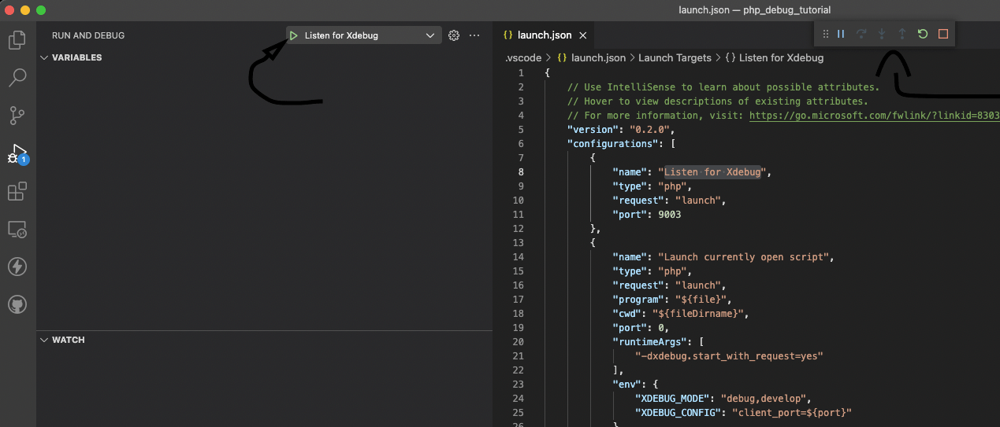
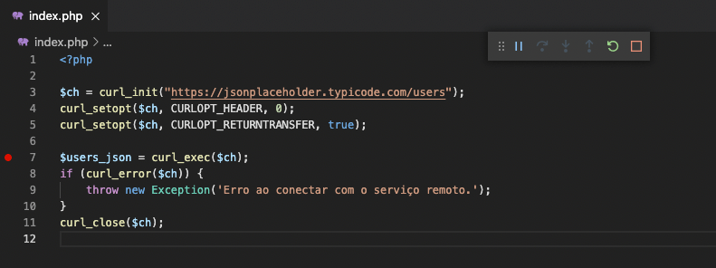
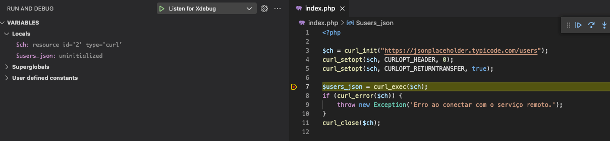
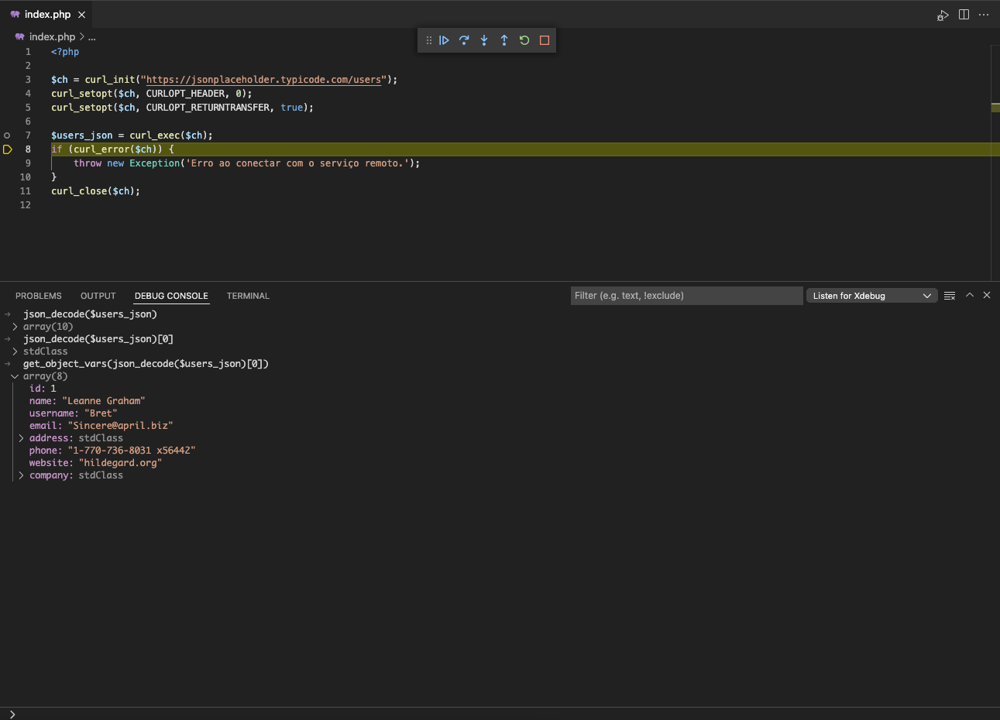
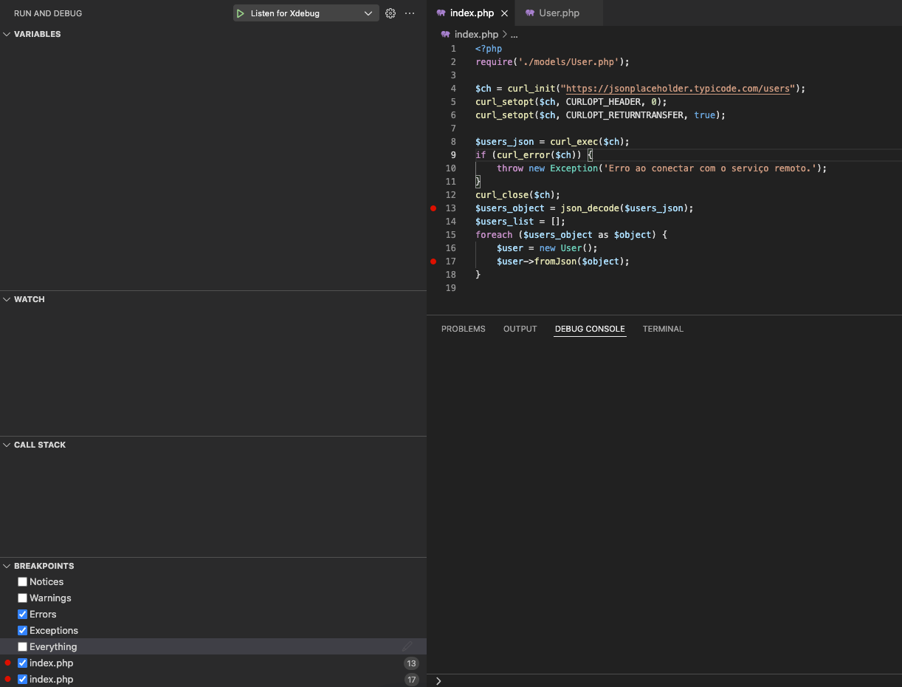

Depurando PHP com XDEBUG no VS Code

<abbr title="muito grande; nem li">mg;nl</abbr>: Neste post vamos configurar o XDEBUG e utilizar o VScode para depurar um script simples em PHP.

Muitas vezes a preguiça nos mantém presos ao `var_dump` e F5 como forma de depurar no PHP. Esse post serve como uma cola, misturei as informações de alguns artigos e tutoriais que encontrei pela net, e adaptei pra incluir alguns detalhes que me confundiram quando fui configurar a minha máquina. As fontes estão no final do post.

Este tutorial foi feito utilizando a versão 7.1 do PHP no macOS. Para outras versões, os passos são os mesmos mas as informações adicionadas diferem um pouco.

Você pode consultar [este post](https://getgrav.org/blog/macos-monterey-apache-mysql-vhost-apc) para verificar qual versão do XDEBUG deve ser instalado com qual versão do PHP.

## Instalação do XDEBUG e extensão VSCODE

Abaixo mostro o processo para instalação do XDEBUG em um ambiente macOS. No macOS, presumo que tanto o PHP quanto o APACHE foram instalados utilizando o brew.

Com o XDEBUG instalado na máquina, vamos configurar a extensão do XDEBUG no VScode e depurar um script simples.

## Instale o XDEBUG usando o pecl

Comece instalando o xdebug utilizando o `pecl`.

    sphp 7.1
    pecl uninstall -r xdebug
    pecl install xdebug-2.9.8

Depois, remova a linha `zend_extension="xdebug.so"`, no topo do arquivo `php.ini`.

    code /opt/homebrew/etc/php/7.1/php.ini

    zend_extension="xdebug.so" ## REMOVER ESTA LINHA
    [PHP]

    ;;;;;;;;;;;;;;;;;;;
    ; About php.ini   ;
    ;;;;;;;;;;;;;;;;;;;
    ; PHP's initialization file, generally called php.ini, is responsible for
    ; configuring many of the aspects of PHP's behavior.

    ; PHP attempts to find and load this configuration from a number of locations.
    ; The following is a summary of its search order:

Após remover esta linha, adicione um novo arquivo de configuração para a biblioteca `xdebug.so`.

    code /opt/homebrew/etc/php/7.1/conf.d/ext-xdebug.ini

    [xdebug]
    zend_extension="xdebug.so"
    xdebug.remote_enable=1
    xdebug.remote_autostart = 1 # essa linha permite o acesso ao xdebug pelo vscode, nos próximos passos
    xdebug.remote_host=localhost
    xdebug.remote_handler=dbgp
    xdebug.remote_port=9000 # essa é a porta onde o xdebug vai rodar seu debugger

Reinicie o apache com os comandos

    brew services stop httpd; brew services start httpd

Instale o script para [ligar/desligar o xdebug](https://github.com/w00fz/xdebug-osx) na sua máquina.

    curl -L https://gist.githubusercontent.com/rhukster/073a2c1270ccb2c6868e7aced92001cf/raw/c1629293bcf628cd6ded20c201c4ef0a2fa79144/xdebug > /opt/homebrew/bin/xdebug
    chmod +x /opt/homebrew/bin/xdebug

Utilize-o com:

    xdebug on
    ## ou
    xdebug off

Você pode verificar se a instalação do xdebug aconteceu sem erros utilizando o [installation wizard](https://xdebug.org/wizard).

Copie o output do seu `php -i` e cole no site.

Na linha de comandos:

    xdebug on; php -i | pbcopy

Depois, abra o site, cole o valor no campo de texto, e clique em "Analyse my phpinfo() output" \( o pbcopy salva o output do comando no seu ctrl+v \).

Um resultado parecido com este significa que deu tudo certo.

    Installation Wizard
    Summary

    Xdebug installed: 2.9.8
    Server API: Command Line Interface
    Windows: no
    Zend Server: no
    PHP Version: 7.1.33
    Zend API nr: 320160303
    PHP API nr: 20160303
    Debug Build: no
    Thread Safe Build: no
    OPcache Loaded: yes
    Configuration File Path: /opt/homebrew/etc/php/7.1
    Configuration File: /opt/homebrew/etc/php/7.1/php.ini
    Extra Configuration Files Path: /opt/homebrew/etc/php/7.1/conf.d
    Extra Configuration Files:
    /opt/homebrew/etc/php/7.1/conf.d/ext-opcache.ini
    /opt/homebrew/etc/php/7.1/conf.d/ext-xdebug.ini
    Extensions directory: /opt/homebrew/lib/php/pecl/20160303

    You're already running the latest Xdebug version

## Configure o XDEBUG no VSCODE

Com o XDEBUG instalado no sistema, vamos configurar o ambiente para depuração no VSCODE.

Como exemplo, vamos criar um projeto simples em php.

Ajuste seu apache para servir os arquivos de uma pasta, onde o index.php terá apenas uma linha:

    ## arquivo index.php
    <?php phpinfo(); ?>

Abra o projeto usando o vscode, vá nas extensões e instale o PHP XDEBUG.

Depois, selecionando seu arquivo index.php, clique em "Run and Debug" e "create a launch.json file".

Digite PHP na barra de busca e clique.

Um arquivo launch.json será criado no seu projeto, e você será redirecionado para editá-lo.

    ## dentro do diretório do projeto

    find .

    .
    ./index.php
    ./.vscode
    ./.vscode/launch.json

O arquivo launch.json vai ter um conteúdo no formato:

    {
        // Use IntelliSense to learn about possible attributes.
        // Hover to view descriptions of existing attributes.
        // For more information, visit: https://go.microsoft.com/fwlink/?linkid=830387
        "version": "0.2.0",
        "configurations": [
            {
                "name": "Listen for Xdebug",
                "type": "php",
                "request": "launch",
                "port": 9000 // alterar para 9000, a mesma porta definida na configuração do XDEBUG
            },
            {
                "name": "Launch currently open script",
                "type": "php",
                "request": "launch",
                "program": "${file}",
                "cwd": "${fileDirname}",
                "port": 0,
                "runtimeArgs": [
                    "-dxdebug.start_with_request=yes"
                ],
                "env": {
                    "XDEBUG_MODE": "debug,develop",
                    "XDEBUG_CONFIG": "client_port=${port}"
                }
            },
            {
                "name": "Launch Built-in web server",
                "type": "php",
                "request": "launch",
                "runtimeArgs": [
                    "-dxdebug.mode=debug",
                    "-dxdebug.start_with_request=yes",
                    "-S",
                    "localhost:0"
                ],
                "program": "",
                "cwd": "${workspaceRoot}",
                "port": 9003,
                "serverReadyAction": {
                    "pattern": "Development Server \\(http://localhost:([0-9]+)\\) started",
                    "uriFormat": "http://localhost:%s",
                    "action": "openExternally"
                }
            }
        ]
    }

Ele registra alguns scripts para ativar o servidor de debug.

Repare que para cada objeto dentro de "configurations", será adicionado uma opção no menu do debugger.

**Atenção**: você deve alterar o valor do "port", na opção "Listen for Xdebug", para a mesma porta definida na configuração do XDEBUG. No meu exemplo, utilizei a porta 9000.

Vamos utilizar a opção "Listen for Xdebug" pois já temos um servidor php rodando com o apache.

Inicie o processo selecionando "Listen for Xdebug" no dropdown e clicando no triangulo verde.

Se o menu com as opções aparecer, o processo iniciou corretamente.

## Depure um programa de teste

No nosso arquivo index.php, podemos adicionar um breakpoint clicando duas vezes na margem da linha (o vscode mostra uma bolinha vermelha).

Agora, atualizando a página no navegador, você deve ser jogado de volta para o VScode.

Caso isto não ocorra, verifique:

1. se criou corretamente o arquivo com as configurações do XDEBUG

2. se colocou a mesma porta no processo do launch.json utilizada na configuração do XDEBUG

3. se você reiniciou o apache utilizando `brew services stop httpd; brew services start httpd`

Observe que a página não carregou normalmente no navegador. Isto é porque nosso breakpoint travou a execução do programa.

Você pode, no editor, apertar F10 para prosseguir para a próxima linha. Como nossa programa é simples, isso resolve a execução e carrega a página.

Os comandos disponíveis são os seguintes:

- Continue / Pause F5
- Step Over F10
- Step Into F11
- Step Out ⇧F11
- Restart ⇧⌘F5 (ctrl+shift+F5 no linux)
- Stop ⇧F5

## Depure uma requisição HTTP

Digamos que você esteja desenvolvendo uma integração com uma API.

Vamos utilizar a API [json placeholder](https://jsonplaceholder.typicode.com/) como exemplo.

Nosso objetivo é importar uma listagem de usuários, e criar um Model para uma futura integração com banco de dados.

Vamos começar realizando uma requisição no endpoint "/users".

    <?php

    $ch = curl_init("https://jsonplaceholder.typicode.com/users");
    curl_setopt($ch, CURLOPT_HEADER, 0);
    curl_setopt($ch, CURLOPT_RETURNTRANSFER, true);

    $users_json = curl_exec($ch); ## (1)
    if (curl_error($ch)) {
        throw new Exception('Erro ao conectar com o serviço remoto.');
    }
    curl_close($ch);

Podemos, antes de prosseguir com o desenvolvimento, adicionar um breakpoint em \(1\).

Acessando nossa página no navegador, somos jogados de volta para o VScode. Repare que a variável `$users_json` ainda está indefinida.

Para acessarmos seu valor, precisamos dar um "Step Over" \(F10\).

Podemos utilizar o debug console para trabalhar a variável em tempo real, sem necessidade de atualizar a página com cada alteração.

Na imagem acima, utilizamos o console pra descobrir a estrutura do Model "User" que precisamos implementar.

Dentro da raíz do projeto, crie um diretório "models", e dentro dele, um arquivo "User.php".

Vamos estruturar de forma simples nossa classe, e criar um método `fromJson`, que recebe os dados no formato de array e os passa para as propriedades do nosso objecto.

    <?php
    ## models/User.php
    class User
    {
        /**
         * @var int
         */
        private $id;

        /**
         * @var string
         */
        private $name;

        /**
         * @var string
         */
        private $username;

        /**
         * @var string
         */
        private $email;

        /**
         * @var stdClass
         */
        private $address;

        /**
         * @var string
         */
        private $phone;

        /**
         * @var string
         */
        private $website;

        /**
         * @var stdClass
         */
        private $company;

        /**
         * @param array $data
         */
        public function fromJson($data)
        {
            foreach ($data as $key => $value) {
                $this->{$key} = $value;
            }
        }
    }

Lembre-se de importar nosso Model no arquivo index.php.

Adicione uma iteração nos valores decodificados da requisição, e, usando o método `fromJson`, adicione novos objetos "User" em uma lista.

    <?php
    require('./models/User.php'); ## ADICIONAR

    $ch = curl_init("https://jsonplaceholder.typicode.com/users");
    curl_setopt($ch, CURLOPT_HEADER, 0);
    curl_setopt($ch, CURLOPT_RETURNTRANSFER, true);

    $users_json = curl_exec($ch);
    if (curl_error($ch)) {
        throw new Exception('Erro ao conectar com o serviço remoto.');
    }
    curl_close($ch);
    $users_object = json_decode($users_json); ## ADICIONAR DAQUI PRA BAIXO
    $users_list = []; 
    foreach ($users_object as $object) {
        $user = new User();
        $user->fromJson($object);
        $users_list[] = $user;
    }

Vamos adicionar dois breakpoints, um na decodificação do json recebido na requisição, e um no momento que chamarmos nosso método `fromJson`.

Na aba "breakpoints", no canto esquerdo inferior, marque também "Errors" e "Exceptions". Assim podemos depurar estes casos também pelo console do debugger.

Ative o debugger clicando no triangulo verde, volte na página do projeto e dê um F5.

Quando o processo for travado, dê um F10 \( Step Over \) e verifique que nossa variável `$users_object` está no formato esperado.

Depois, dê um F5 \( Continue \) para o programa rodar até o próximo breakpoint.

Confirme que a variável `$user` foi iniciada corretamente, com os valores nulos.

Neste breakpoint, vamos utilizar o F11 \(Step Into\). Isto deve nos levar para o arquivo User.php, dentro do método `fromJson`.

Aperte F10 \( Step Over \) algumas vezes, e verifique o valor das variáveis internas do método.

Depois, utilize o ⇧F11 \(Step Out\) para voltar ao arquivo index.php.

## Considerações finais

Verificamos como configurar o xdebug para uso de forma interativa no VScode.

Os exemplos realizados foram simples, mas ilustram conceitos que podem facilitar a depuração de projetos complexos, onde um valor passa por diversas funções e métodos antes de ser jogado na tela através de um `var_dump`, por exemplo.

Usando o Step Over, Step Into e Step Out, podemos verificar todas as etapas de um processo, e testar o comportamento de uma variável, manipulando ela no console, o que diminui o trabalho de alterar o arquivo e atualizar a página, que costuma ser o método tradicional de depurar no php.

Abraço!

Fontes: 

- <https://getgrav.org/blog/macos-monterey-apache-mysql-vhost-apc>
- <https://stackify.com/php-debugging-guide/>
- <https://code.visualstudio.com/docs/editor/debugging#_debug-actions>
- <https://stackoverflow.com/a/5398361>

Tags: vscode, php, debug
