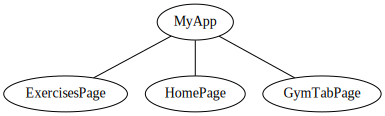
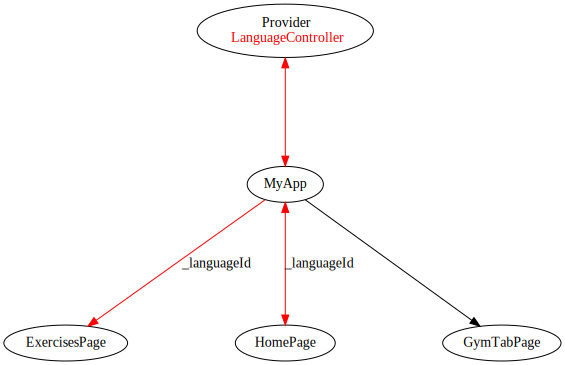

Gerenciando estado num app Flutter com Provider

<abbr title="muito grande; nem li">mg;nl</abbr>: Neste post vamos implementar o plugin [Provider](https://pub.dev/packages/provider) num app em Flutter, para comunicar valores de estado através do aplicativo. Vamos também otimizar a estrutura de um app já existente e entender o uso de controllers no ambito do provider.

Dando sequência ao que começamos [neste post](https://guilhermegarcia.dev/blog/criando-um-app-com-flutter-e-sqlite.html), vamos seguir desenvolvendo nosso app de acadêmia.

No fim do post anterior, nosso app consistia em um seletor de linguagem e, ao trocarmos a linguagem, atualizavamos os valores da nossa listagem de exercícios.

Neste post, vamos implementar o plugin [Provider](https://pub.dev/packages/provider) para gerenciar o estado global do nosso app, assim como subdividir o código em uma estrura mais intuitiva, mostrando como podemos implementar o `Provider` para uma única, ou múltiplas, classes.

O código finalizado desta postagem pode ser baixado [neste branch do repositório](https://github.com/guites/flutter-gym-app/tree/select_exercises).

## Overview do projeto

Nosso objetivo neste post é deixar o app da seguinte forma:

Para isso, vamos seguir os seguintes passos:

1. Separar o código em uma estrura de pages \( lógica de renderização \) e controllers \( lógica de estado do app \).
2. Implementar o plugin Provider para acessar valores comuns em diferentes widgets e pages.
3. Adicionar um sistema de "carrinho", onde o usuário pode selecionar diferentes exercícios de uma listagem.

## Re estruturando o código - páginas

Nessa nova versão do app, teremos três páginas:

1. HomePage: Permite ao usuário escolher a linguagem utilizada no app.
2. ExercisesPage: Mostra a listagem dos exercícios ao usuário. Ao clicar em um exercício, adiciona-o a listagem do carrinho (que vamos chamar de GymTab)
3. GymTabPage: Tem a funcionalidade de um carrinho. Mostra a listagem dos exercícios selecionados pelo usuário. Permite removê-los da listagem.

Estas três páginas terão o mesmo nível hierárquico, ou seja, as três serão dependentes diretas do nosso Widget principal, `MyApp`.

Vamos iniciar ajustando nosso arquivo `main.dart`.

Utilizaremos o conceito de rotas para direcionar o usuário para diferentes páginas.

    class MyApp extends StatelessWidget {
      const MyApp({Key? key}) : super(key: key);

      // This widget is the root of your application.
      @override
      Widget build(BuildContext context) {
        return MaterialApp(
          title: 'Workout app',
          theme: ThemeData(
            primarySwatch: Colors.blue,
          ),
          initialRoute: '/',
          routes: {
            '/': (context) => const HomePage(title: 'Home'), // (1)
            '/exercises': (context) => const ExercisesPage(title: 'Exercises'),
            '/gym-tab': (context) => const GymTabPage(title: 'Gym Tab'),
          },
        );
      }
    }

Em \(1\), definimos a rota '/' como nosso `HomePage` Widget. Optei por renomeá-lo \(era MyHomePage\).

Criamos uma rota para cada página mencionada acima. Definimos como página inicial \( nossa `initialRoute` \), a rota equivalente à `HomePage`.

Depois, vamos criar um novo diretório, `pages`, onde será colocado todo código referente a renderização das páginas.

### Criando o arquivo para `HomePage`

Vamos pegar nosso `HomePage` Widget \(antigo `MyHomePage` caso você tenha acompanhado a parte 1 deste post\), e movê-lo para um novo arquivo, `pages/home_page.dart`.

    import 'package:flutter/material.dart';
    import 'package:workout_app/api/languages.dart';
    import 'package:workout_app/models/language.dart';

    class HomePage extends StatefulWidget {
      const HomePage({Key? key, required this.title}) : super(key: key);

      final String title;

      @override
      State<HomePage> createState() => _HomePageState();
    }

    class _HomePageState extends State<HomePage> {

      int _selectedLanguage = 2;

      List<DropdownMenuItem<int>> createDropdownItems(snapshot) {
        List<DropdownMenuItem<int>> items = [];
        snapshot.data.forEach((Language item) {
          items.add(DropdownMenuItem<int>(
            child: Text(item.full_name),
            value: item.id,
          ));
        });
        return items;
      }

      @override
      Widget build(BuildContext context) {
        return Scaffold(
            appBar: AppBar(
              title: Text(widget.title),
            ),
            body: Center(
              child: Column(
                mainAxisAlignment: MainAxisAlignment.start,
                children: <Widget>[
                  Text(
                    'The gym',
                    style: Theme.of(context).textTheme.headline3,
                  ),
                  const Divider(),
                  const Text(
                    'Choose a language',
                  ),
                  FutureBuilder(
                    future: languages(),
                    builder:
                        (BuildContext context, AsyncSnapshot<dynamic> snapshot) {
                      if (snapshot.connectionState == ConnectionState.waiting) {
                        return const Center(
                          child: CircularProgressIndicator(),
                        );
                      }
                      if (snapshot.connectionState == ConnectionState.done) {
                        return DropdownButton(
                          value: _selectedLanguage,
                          onChanged: (int? newValue) {
                            setState(() {
                              _selectedLanguage = newValue!;
                            });
                          },
                          items: createDropdownItems(snapshot),
                        );
                      }
                      return const Text('Ocorreu um erro!');
                    },
                  ),
                  TextButton(onPressed: () { // (1)
                    Navigator.pushNamed(context, '/exercises');
                  }, child: const Text('Go to Exercises Page'))
                ],
              ),
            ),
          );
      }
    }

Repare que diminuímos o código da página. A `HomePage` será responsável apenas por definir a linguagem do aplicativo. Por isso, mantemos apenas um dos nossos `FutureBuilder`.

Em \(1\), adicionamos um botão que nos redireciona para a página dos exercícios. Lá será renderizada a listagem que tinhamos antes na nossa Home.

Repare que clicar neste botão nos gera um erro, pois ainda não criamos o arquivo para a rota `/exercises`.

Lembre-se de adicionar o import no seu `main.dart`:

    import 'package:flutter/material.dart';
    import 'package:workout_app/pages/home_page.dart'; // ADICIONAR

    void main() {
      runApp(const MyApp());
    }

### Criando o arquivo para `ExercisesPage`

Vamos criar um novo arquivo, `pages/exercises_page.dart`, onde será colocado o código responsável pela listagem dos exercícios na linguagem escolhida.

    import 'package:flutter/material.dart';
    import 'package:workout_app/api/exercises.dart';

    class ExercisesPage extends StatefulWidget {
      const ExercisesPage({Key? key, required this.title}) : super(key: key);

      final String title;

      @override
      _ExercisesPageState createState() => _ExercisesPageState();
    }

    class _ExercisesPageState extends State<ExercisesPage> {
      int _selectedLanguage = 2; // (1)

      @override
      Widget build(BuildContext context) {
        return Scaffold(
            appBar: AppBar(
              title: Text(widget.title),
              actions: [
                IconButton(
                  onPressed: () => Navigator.pushNamed(context, '/gym-tab'), // (2)
                  icon: const Icon(Icons.list_alt_rounded),
                ),
              ],
            ),
            body: Column(
              children: [
                FutureBuilder(
                  future: exercises(_selectedLanguage),
                  builder: (BuildContext context, AsyncSnapshot<dynamic> snapshot) {
                    if (snapshot.connectionState == ConnectionState.waiting) {
                      return const Center(
                        child: CircularProgressIndicator(),
                      );
                    }
                    if (snapshot.connectionState == ConnectionState.done) {
                      return Expanded(
                        child: ListView.builder(
                            itemCount: snapshot.data.length,
                            itemBuilder: (context, index) {
                              return ListTile(
                                title: Text(snapshot.data[index].name),
                              );
                            }),
                      );
                    }
                    return const Text('Ocorreu um erro!');
                  },
                ),
              ],
            ));
      }
    }

Nesta página, adicionamos o restante do código que estava anteriormente no nosso `main.dart`.

Quando o usuário acessá-la, rodamos nossa requisição ao banco de dados, e, através do `FutureBuilder`, renderizamos os resultados.

Repare que em \(1\), o valor da linguagem está hard coded, ou seja, independente do valor escolhido na `HomePage`, vamos renderizar sempre os exercícios com o `language_id` 2, em inglês. Vamos resolver este problema mais adiante, utilizando o `Provider`.

Em \(2\), adicionamos um botão em nossa `AppBar`, que direciona o usuário para a página com os exercícios selecionados \(nossa `GymTab`\). Vamos agora criar este arquivo.

Lembre-se de adicionar o import em `main.dart`:

    import 'package:flutter/material.dart';
    import 'package:workout_app/pages/exercises_page.dart'; // ADICIONAR
    import 'package:workout_app/pages/home_page.dart';

    void main() {
      runApp(const MyApp());
    }

Vamos agora criar nosso arquivo para a listagem dos exercícios selecionados.

### Criando o arquivo para `GymTabPage`

Este arquivo por enquanto vai mostrar uma mensagem estática. Na próxima sessão, vamos ver como passar os dados dos exercícios selecionados para listá-los aqui.

Crie o arquivo em `pages/gym_tab_page.dart`

    import 'package:flutter/material.dart';

    class GymTabPage extends StatelessWidget {
      final String title;

      const GymTabPage({Key? key, required this.title}) : super(key: key);

      @override
      Widget build(BuildContext context) {
        return Scaffold(
          appBar: AppBar(
            title: Text(title),
          ),
          body: Column(
            children: const [
              Expanded(
                child: Center(
                  child: Text('You haven\'t picked any exercises yet!'),
                ),
              ),
            ],
          ),
        );
      }
    }

E adicione o import em `main.dart`

    import 'package:flutter/material.dart';
    import 'package:workout_app/pages/exercises_page.dart';
    import 'package:workout_app/pages/gym_tab_page.dart'; // ADICIONAR
    import 'package:workout_app/pages/home_page.dart';

    void main() {
      runApp(const MyApp());
    }

Com a estrutura das páginas prontas, vamos criar nossos `controllers`, que serão utilizados para guardar os valores de estado do aplicativo, como a linguagem escolhida e os exercícios selecionados.

## Re estruturando o código - controllers

Como reparamos na seção anterior, nossa `HomePage` e nossa `ExercisesPage` ambas possuem uma variável `_selectedLanguage`, que é isolada uma da outra.

Precisamos também de uma forma de comunicar os exercícios selecionados pelo usuário em `ExercisesPage`, para mostrá-los em `GymTabPage`.

### Criando o `LanguageController`

Para mantermos uma congruência entre a linguagem escolhida, vamos criar uma classe especializada, `LanguageController`.

Seu único objetivo será informar e guardar o valor da linguagem escolhida pelo usuário.

Crie um diretório, `controller`, e dentro dele, o arquivo `language_controller`.

    import 'package:flutter/material.dart';

    class LanguageController extends ChangeNotifier { // (1)
      /// Variável privada, só pode ser acessada internamente por esta classe
      int _languageId = 2; // defaults to english

      /// Método getter, permite acesso a linguagem atual pelas views
      int get currentLanguage => _languageId;

      /// Método setter utilizado para atualizar o valor da linguagem atual
      int setLanguage(int langId) {
        _languageId = langId;
        notifyListeners(); // (2)
        return _languageId;
      }

    }

Repare que nossa classe extende a classe `ChangeNotifier` \(1\). Isso vai nos permiter integrá-la com o plugin `Provider`.

Em \(2\), ao utilizarmos o método `setLanguage`, atualizamos o valor da variável privada `_languageId` e chamamos a função `notifyListeners()`. Esta função vai avisar todos os widgets dependentes do nosso `LanguageController` para renderizar seu componentes novamente.

Agora vamos criar o controller para os exercícios, e depois vamos conectá-los utilizando o `Provider`.

### Criando o `GymTabController`

O objetivo desta classe é manter uma listagem de exercícios. Quando o usuário selecionar um na listagem \(ExercisesPage\), ele deve ser adicionado, e quando o usuário removê-lo \(GymTabPage\), ele deve ser subtraído da lista.

Esta classe também vai extender `ChangeNotifier`, pois vai ser utilizada em diferentes páginas do nosso app.

Crie, em `controller`, o arquivo `gym_tab_controller.dart`.

    import 'dart:collection';

    import 'package:flutter/material.dart';
    import 'package:workout_app/models/exercise.dart';

    class GymTabController extends ChangeNotifier {
      /// Internal, private state of the cart.
      final List<Exercise> _exercises = []; // (1)

      /// An unmodifiable view of the items in the cart.
      UnmodifiableListView<Exercise> get exercises => UnmodifiableListView(_exercises); // (2)

      /// The current quantity of exercises
      int get exerciseCount => _exercises.length;

      /// Adds [exercise] to cart. This and [removeAll] are the only ways to modify the
      /// cart from the outside.
      void add(Exercise exercise) {
        _exercises.add(exercise);
        // This call tells the widgets that are listening to this model to rebuild.
        notifyListeners();
      }

      void remove(Exercise exercise) {
        _exercises.remove(exercise);
        notifyListeners();
      }

      /// Removes all items from the cart.
      void removeAll() {
        _exercises.clear();
        // This call tells the widgets that are listening to this model to rebuild.
        notifyListeners();
      }
    }

Em \(1\), criamos uma listagem, como uma variável interna à classe, para manter os exercícios selecionados pelo usuário.

Em \(2\), criamos um `Getter`, para acessar a lista de exercícios fora da classe.

Os outros métodos lidam com a adição e remoção dos itens \(todos eles <Exercise>\) da listagem.

## Implementando o plugin Provider

Para que possamos "compartilhar" valores entre diversos Widgets no nosso app, precisamos de algum plugin para gestão de estado.

Optei pelo Provider pois é o indicado nos tutoriais do flutter. Outra opção seria, por exemplo, a biblioteca [bloc](https://bloclibrary.dev/#/). 

Para utilizar o Provider, vamos adicionar a seguinte linha no nosso `pubspec.yaml`:

    dependencies:
      flutter:
        sdk: flutter
      sqflite:
      path:
      built_value: ^8.1.4
      built_collection: ^5.1.1
      provider: ^6.0.2 # ADICIONAR

Depois, rode um `flutter pub get` na raíz do projeto.

Até então, a estrutura do nosso projeto é a seguinte:

### Consumindo valores do `LanguageController`

Vamos adicionar um Widget provider, de forma a comunicar os valores da nossa `LanguageController` entre `ExercisesPage`, `HomePage` e `MyApp`.

Repare que temos uma seta unidirecional entre `MyApp` e `ExercisesPage`, ou seja, apenas consumimos o valor de `_languageId` na nossa listagem de exercícios, enquanto a seta é bidirecional entre `HomePage` e `MyApp`, ou seja, este é o Widget no qual podemos alterar o seu valor.

Começamos colocando nosso Widget `MaterialApp` dentro de um `Provider`, no método `build` em `main.dart`.

    class MyApp extends StatelessWidget {
      const MyApp({Key? key}) : super(key: key);

      // This widget is the root of your application.
      @override
      Widget build(BuildContext context) { // ADICIONAR PROVIDER ABAIXO
        return Provider(
          create: (_) => LanguageController(),
          child: MaterialApp(
            title: 'Workout app',
            theme: ThemeData(
              primarySwatch: Colors.blue,
            ),
            initialRoute: '/',
            routes: {
              '/': (context) => const HomePage(title: 'Home'), // (1)
              '/exercises': (context) => const ExercisesPage(title: 'Exercises'),
              '/gym-tab': (context) => const GymTabPage(title: 'Gym Tab'),
            },
          ),
        );
      }
    }

Agora, vamos adicionar um Widget `Consumer` em `pages/home_page.dart`, para termos acesso à classe da qual a página depende.

     @override
      Widget build(BuildContext context) {
        return Consumer<LanguageController>( // ADICIONAR
          builder: (context, languageController, child) => Scaffold( // ALTERAR
              appBar: AppBar(
                title: Text(widget.title),
              ),
              body: Center(
                child: Column(
                  mainAxisAlignment: MainAxisAlignment.start,
                  children: <Widget>[
                  ...
                  ..
                  .

Podemos acessar o `LanguageController` dentro do nosso método build.

Não precisamos mais da variável interna `_selectedLanguage`:

    class _HomePageState extends State<HomePage> {

      int _selectedLanguage = 2; // REMOVER

Vamos alterar a função de callback ao alterar a linguagem no dropdown.

                FutureBuilder(
                  future: languages(),
                  builder:
                      (BuildContext context, AsyncSnapshot<dynamic> snapshot) {
                    if (snapshot.connectionState == ConnectionState.waiting) {
                      return const Center(
                        child: CircularProgressIndicator(),
                      );
                    }
                    if (snapshot.connectionState == ConnectionState.done) {
                      return DropdownButton(
                        value: languageController.currentLanguage, // ALTERAR
                        onChanged: (int? newValue) {
                          setState(() {
                            languageController.setLanguage(newValue!); // ALTERAR
                          });
                        },
                        items: createDropdownItems(snapshot),
                      );
                    }
                    return const Text('Ocorreu um erro!');
                  },

Agora, os valores são passados via `Provider`, e atualizam o valor da classe através do método `setLanguage`.

Nosso próximo passo é utilizar esse valor na nossa `ExercisesPage`.

Como nosso Widget `ExercisesPage` está "abaixo" do `Provider<LanguageController>` \( confira o arquivo `main.dart` \), e nós precisamos de apenas um valor da classe, \( \_languageId \), podemos utilizar a função `context.select`.

Esta função faz com que nosso Widget seja recriado apenas quando esta propriedade específica seja alterada.

Em `pages/exercises_page.dart`, altere as seguintes linhas:

    class _ExercisesPageState extends State<ExercisesPage> {
      int _selectedLanguage = 2; // DELETAR

      @override
      Widget build(BuildContext context) {
        final int appCurrentLanguage = context.select<LanguageController, int>( // ADICIONAR
          // Estamos apenas interessados no valor atual de [currentLanguage]
            (languageController) => languageController.currentLanguage,
        );
        return Scaffold(
            appBar: AppBar(
              title: Text(widget.title),
              actions: [
                IconButton(
                  onPressed: () => Navigator.pushNamed(context, '/gym-tab'),
                  icon: const Icon(Icons.list_alt_rounded),
                ),
              ],
            ),
            body: Column(
              children: [
                FutureBuilder(
                  future: exercises(appCurrentLanguage), // ALTERAR
                  builder: (BuildContext context, AsyncSnapshot<dynamic> snapshot) {
                    if (snapshot.connectionState == ConnectionState.waiting) {
                      return const Center(
                        child: CircularProgressIndicator(),
                      );
                    }
                    ...
                    ..
                    .

Agora, o id da linguagem passado no nosso `FutureBuilder` será sempre o valor atual do nosso `LanguageController`.

Você pode verificar o funcionamento fazendo um hot restart do seu app.

### Selecionando exercícios e consumindo o `GymTabController`

Agora que nosso seletor de linguagem funciona corretamente, podemos passar para o uso do "carrinho", ou seja, selecionar exercícios em `ExercisesPage` e visualizá-los em `GymTabPage`.

Para isso, precisamos alterar a forma como utilizamos o `Provider` em nosso `main.dart`.

Vamos alterá-lo para um `MultiProvider`, e passaremos os controllers como uma listagem.

Em `main.dart`:

    class MyApp extends StatelessWidget {
      const MyApp({Key? key}) : super(key: key);

      // This widget is the root of your application.
      @override
      Widget build(BuildContext context) {
        return MultiProvider(
          // ALTERAR
          providers: [
            // ADICIONAR
            ChangeNotifierProvider(
              create: (context) => GymTabController(),
            ),
            ChangeNotifierProvider(
              create: (context) => LanguageController(),
            ),
          ],
          child: MaterialApp(
            title: 'Workout app',
            theme: ThemeData(
              primarySwatch: Colors.blue,
            ),
            initialRoute: '/',
            routes: {
              '/': (context) => const HomePage(title: 'Home'), // (1)
              '/exercises': (context) => const ExercisesPage(title: 'Exercises'),
              '/gym-tab': (context) => const GymTabPage(title: 'Gym Tab'),
            },
          ),
        );
      }
    }

Desta forma, podemos escalar nosso App para o uso de quantos Providers for necessário.

Agora, em `ExercisesPage`, vamos adicionar, para cada item da listagem, um botão que chama o método `add` do nosso `GymTabController`.

Adicione o seguinte código no final da página, após o fechamento da `class _ExercisesPageState`:

    class _AddButton extends StatelessWidget {
      final Exercise exercise;

      const _AddButton({required this.exercise, Key? key}) : super(key: key);

      @override
      Widget build(BuildContext context) {
        // The context.select() method will let you listen to changes to
        // a *part* of a model. You define a function that "selects" (i.e. returns)
        // the part you're interested in, and the provider package will not rebuild
        // this widget unless that particular part of the model changes.
        //
        // This can lead to significant performance improvements.
        final bool isInGymTab = context.select<GymTabController, bool>(
          // Here, we are only interested whether [exercise] is inside the gym tab.
          (gymTab) => gymTab.exercises.contains(exercise),
        );

        return TextButton(
          onPressed: isInGymTab
              ? null
              : () {
                  // If the item is not in cart, we let the user add it.
                  // We are using context.read() here because the callback
                  // is executed whenever the user taps the button. In other
                  // words, it is executed outside the build method.
                  var gymTab = context.read<GymTabController>();
                  gymTab.add(exercise);
                },
          style: ButtonStyle(
            overlayColor: MaterialStateProperty.resolveWith<Color?>((states) {
              if (states.contains(MaterialState.pressed)) {
                return Theme.of(context).primaryColor;
              }
              return null; // Defer to the widget's default.
            }),
          ),
          child: isInGymTab
              ? const Icon(Icons.check, semanticLabel: 'ADDED')
              : const Text('ADD'),
        );
      }
    }

Utilizamos aqui a mesma função, `context.select`, para acessarmos apenas uma propriedade de `GymTabController`, a lista `exercises`.

Vamos adicionar um Widget `_addButton` para cada `ListTile`.

      child: ListView.builder(
          itemCount: snapshot.data.length,
          itemBuilder: (context, index) {
            return ListTile(
              title: Text(snapshot.data[index].name),
              trailing: _AddButton(exercise: snapshot.data[index]), // ADICIONAR
            );
          }),

Passamos como parametro o valor retornado pelo `FutureBuilder`, no index atual da geração do nosso `ListView.builder`.

Neste ponto, nossos exercícios já estão sendo adicionados à listagem do controller, mas ainda não criamos o método para sua visualização em `GymTabPage`.

Vamos voltar para `GymTabPage` e adicionar um noso Widget, que cuide da renderização da listagem.

Adicione, em `pages/gym_tab_page.dart`, após o fechamento da classe `class GymTabPage`.

    class _TabList extends StatelessWidget {
      @override
      Widget build(BuildContext context) {
        // This gets the current state of GymTabController and also tells Flutter
        // to rebuild this widget when GymTabController notifies listeners (in other words,
        // when it changes).
        final GymTabController gymTab = context.watch<GymTabController>(); // (1)

        return gymTab.exerciseCount > 0
            ? ListView.builder(
            itemCount: gymTab.exerciseCount,
            itemBuilder: (context, index) => ListTile(
                leading: const Icon(Icons.done),
                trailing: IconButton(
                  icon: const Icon(Icons.remove_circle_outline),
                  onPressed: () => gymTab.remove(gymTab.exercises[index]), // (2)
                ),
                title: Text(gymTab.exercises[index].name)))
            : const Center(child: Text('You haven\'t picked any exercises yet!'));
      }
    }

Em \(1\), utilizamos o `context.watch` para forçar este Widget a ser reconstruído sempre que os valores do `GymTabController` forem alterados.

Em \(2\), utilizamos o método `GymTabController.remove`, que definimos anteriormente, para remover os exercícios da listagem.

Agora temos a funcionalidade de carrinho finalizada!

## Considerações finais

Neste post vimos algumas formas diferentes de utilizar o plugin `Provider` para gestão de estado em aplicativos Flutter. 

Verificamos que existem diferentes funções que permitem acessar os dados de uma classe de forma parcial, recriando nosso Widgets apenas quando valores específicos são alterados, diminuindo o trabalho realizado pelo app.

Implementamos, através do `GymTabController`, a lógica de adição de itens ao carrinho, muito recorrente na criação de apps, independente do seu objetivo.

Abraço!

Fontes:

- <https://pub.dev/packages/provider>
- <https://docs.flutter.dev/development/data-and-backend/state-mgmt/simple>
- <https://docs.flutter.dev/development/data-and-backend/state-mgmt/ephemeral-vs-app>

Tags: flutter
