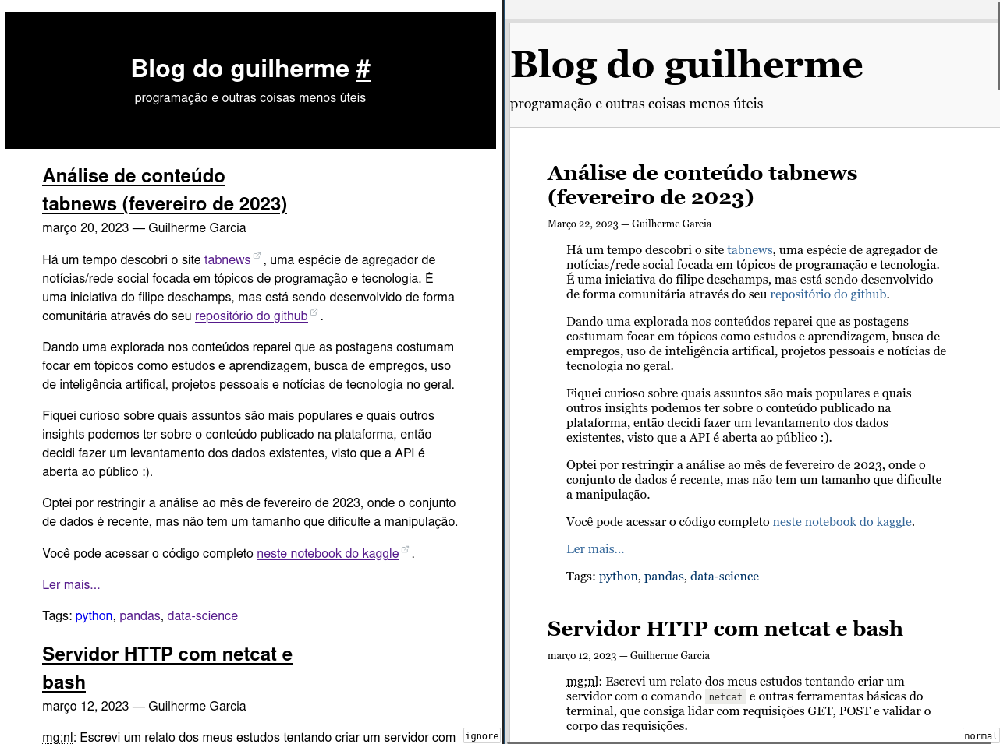

Otimizando acessibilidade e legibilidade

<abbr title="muito grande;nem li">mg;nl</abbr>: neste post trago um levantamento das alterações que fiz no css e html do blog pra deixá-lo mais acessível e legível.

O objetivo principal de um blog é disponibilizar texto escrito. Faz sentido que o layout dele seja otimizado pra leitura, assim como num livro.

A internet, porém, costuma aproximar os blogs mais da ideia de uma revista, onde o conteúdo escrito é permeado de anúncios e precisa competir com distrações como links externos e [CTAs](https://en.wikipedia.org/wiki/Call_to_action_(marketing\)) tentando puxar sua atenção para atividades mais "rentáveis".

Um dos _meus_ objetivos com esse blog é mantê-lo o mais direto ao ponto possível, pra que os leitores consigam extrair as informações e ir embora, sem nenhum passo intermediário.

Pensando nisso fiz algumas mudanças no css utilizado e na disposição do conteúdo, na busca de aumentar a legibilidade e acessibilidade do blog.

Mapeei os seguintes problemas com o layout antigo:

- HTML não semântico (usando `div`s em tudo!).
- Espaçamento entre linhas apertado.
- Má disposição do conteúdo (pouco aproveitamento do espaço de tela).
- CSS quebrando normas de acessibilidade.

Junto com alguns apontamentos que encontrei no search console do google quanto à usabilidade do blog em dispositivos mobile:

- Fonte muito pequena.
- Elementos clicáveis muito próximos.
- Conteúdo mais largo que a tela.

Abaixo eu explico as alterações realizadas e como elas resolvem os problemas listados.

## Detectando problemas de acessibilidade

Antes de pensar em estilização e legibilidade, busquei entender quais os maiores problemas de acessibilidade no layout antigo.

Para isso, usei a ferramenta [axe](https://github.com/dequelabs/axe-core-npm/tree/develop/packages/cli). Se trata de uma lib open source que recebe URLs e acessa-as usando uma versão _headless_ do google chrome.

Você pode ver a minha implementação do axe [nesse repositório](https://github.com/guites/simple-axe-docker).

Como resultado, ela gera uma lista de falhas encontradas na acessibilidade do site, devido ao mau uso do HTML e CSS.

Comecei pelo index.html do blog, e recebi os seguintes apontamentos:

1. Violation of "heading-order" with 1 occurrences! [Details](https://dequeuniversity.com/rules/axe/4.6/heading-order)
2. Violation of "landmark-one-main" with 1 occurrences! [Details](https://dequeuniversity.com/rules/axe/4.6/landmark-one-main)
3. Violation of "link-in-text-block" with 17 occurrences! [Details](https://dequeuniversity.com/rules/axe/4.6/link-in-text-block)
4. Violation of "region" with 2 occurrences! [Details](https://dequeuniversity.com/rules/axe/4.6/region)
5. Violation of "scrollable-region-focusable" with 5 occurrences! [Details](https://dequeuniversity.com/rules/axe/4.6/scrollable-region-focusable)

### 1. Violation of "heading-order" (violação da ordem dos títulos)

O primeiro erro encontrado se refere a ordem dos títulos (headings) usados no blog.

>Ensures the order of headings is semantically correct. Correct invalid elements at:
>     - h3:nth-child(1)

Basicamente, o html gerado pelo meu CMS estava pulando o cabeçalho de nível h2. O título do blog ("Blog do guilherme") tinha nível h1, e o título das postagens ia direto para h3.

    <body>
        

            

                

                    

                        <h1 class="nomargin"> <!-- título nível h1
                            <a class="ablack" href="https://guilhermegarcia.dev/blog/index.html">
                            Blog do guilherme
                            </a>
                        </h1>
                        
programação e outras coisas menos úteis

                    

                

            

            

                

                    <h3> <!--- título nível h3!
                        <a class="ablack" href="analise-de-conteudo-tabnews-fevereiro-de-2023.html">
                            Análise de conteúdo tabnews (fevereiro de 2023)
                        </a>
                    </h3>

Isso tem um impacto negativo para usuários de leitores de tela, pois os aplicativos costumam usar os títulos (headings) para navegar entre seções do texto.

Esse erro é de impacto **moderado** e afeta usuários que sofrem com problemas de visão, audição e mobilidade.

### 2. Violation of "landmark-one-main" (o documento deve ter um marco principal)

O segundo erro se refere ao uso da tag `main` como base do conteúdo principal da página.

>Ensures the document has a main landmark. Correct invalid elements at:
>     - html

O layout antigo colocava o conteúdo principal da página (que é a listagem dos ultimos posts com o seu resumo) dentro de uma `div`com a classe `divbody`.

Leitores de página utilizam os marcos de uma página (tags como `header`, `main`, `footer`) para agilizar a navegação dos usuários.

Esse problema também tem impacto moderado para usuários de leitores de tela.

### 3. Violation of "link-in-text-block" (violação de links em bloco de texto)

O terceiro erro me surpreendeu. Um link deve ser distinguivel do corpo do texto onde se encontra por outros fatores além da sua cor.

>Ensure links are distinguished from surrounding text in a way that does not rely on color.

Por exemplo, no parágrafo abaixo, vamos estilizar os links de duas maneiras diferentes. Na primeira, apenas com a cor, e na segunda, usando a propriedade `text-decoration`.

>O link a seguir possui apenas a cor como diferencial: <a href="" style="text-decoration: none;">primeiro link</a>. Este próximo link também possui um decorador (o underline): <a href="" style="text-decoration: underline wavy red">segundo link</a>.

Usuários com problemas de visão possuem dificuldade em notar trocas sutis de contraste, e podem não entender que uma palavra contém um link se utilizarmos apenas a mudança de cor como indicativo.

Esse é um erro de impacto **alto** e afeta usuários com problema de visão e daltonismo.

### 4. Violation of "region" (não utilização de marcos para elementos com função definida)

O quarto erro é muito parecido com o segundo. No layout antigo, eram utilizadas `div`s para o cabeçalho do blog e para o corpo do texto.

    <body>
        

            
 <!-- isso deveria ser um <header>!
             ...
             

             
 <!-- isso deveria ser um <main>!
             ...
             

Novamente, isso vai dificultar leitores de tela a diferenciar entre o conteúdo principal da página de conteúdos auxiliares, como o nome e descrição do blog no cabeçalho.

### 5. Violation of "scrollable-region-focusable" (regiões com scroll não são focáveis)

Esse também foi novidade pra mim:

>Ensure elements that have scrollable content are accessible by keyboard.

Os itens apontados como causando os erros foram

>- pre:nth-child(55)
>- pre:nth-child(57)
>- pre:nth-child(60)
>- pre:nth-child(62)
>- pre:nth-child(76)

Que são justamente os blocos `<pre><code>` que eu utilizo pra postar blocos compridos de código.

Acontece que **usuários que navegam exclusivamente pelo teclado precisam conseguir focar em elementos que possuem scroll horizontal**, se não eles não tem como ler todo o conteúdo.

Como exemplo, vamos analisar o bloco de código abaixo. Vou criá-lo com a propriedade `tabindex=-1`, ou seja, vou impedir que ele seja focado com o teclado.

<pre tabindex=-1><code>Você não vai conseguir ler o resto disso daqui sem usar o mouse! >:) "Sed ut perspiciatis unde omnis iste natus error sit voluptatem accusantium doloremque laudantium, totam rem aperiam, eaque ipsa quae ab illo inventore veritatis et quasi architecto beatae vitae dicta sunt explicabo. Nemo enim ipsam voluptatem quia voluptas sit aspernatur aut odit aut fugit, sed quia consequuntur magni dolores eos qui ratione voluptatem sequi nesciunt. Neque porro quisquam est, qui dolorem ipsum quia dolor sit amet, consectetur, adipisci velit, sed quia non numquam eius modi tempora incidunt ut labore et dolore magnam aliquam quaerat voluptatem. Ut enim ad minima veniam, quis nostrum exercitationem ullam corporis suscipit laboriosam, nisi ut aliquid ex ea commodi consequatur? Quis autem vel eum iure reprehenderit qui in ea voluptate velit esse quam nihil molestiae consequatur, vel illum qui dolorem eum fugiat quo voluptas nulla pariatur?</code></pre>

Como você scrollaria o bloco acima sem usar o mouse? É impossível.

<pre tabindex=0><code>Você pode me scrollar dando tab aqui pra dentro! :D "Sed ut perspiciatis unde omnis iste natus error sit voluptatem accusantium doloremque laudantium, totam rem aperiam, eaque ipsa quae ab illo inventore veritatis et quasi architecto beatae vitae dicta sunt explicabo. Nemo enim ipsam voluptatem quia voluptas sit aspernatur aut odit aut fugit, sed quia consequuntur magni dolores eos qui ratione voluptatem sequi nesciunt. Neque porro quisquam est, qui dolorem ipsum quia dolor sit amet, consectetur, adipisci velit, sed quia non numquam eius modi tempora incidunt ut labore et dolore magnam aliquam quaerat voluptatem. Ut enim ad minima veniam, quis nostrum exercitationem ullam corporis suscipit laboriosam, nisi ut aliquid ex ea commodi consequatur? Quis autem vel eum iure reprehenderit qui in ea voluptate velit esse quam nihil molestiae consequatur, vel illum qui dolorem eum fugiat quo voluptas nulla pariatur?</code></pre>

Esse último bloco é acessível usando <kbd>tab</kbd> ou <kbd>shift + tab</kbd>, e então você consegue usar a barra de scroll com as setinhas do teclado.

Pra isso, você precisa se certificar de que **todo elemento com scroll horizontal possua a propriedade `tabindex=0`**!

Nota: o firefox parece adicionar essa propriedade nos blocos com scroll horizontal por padrão, enquanto com o google chrome eu só consegui focar os elementos nos quais eu coloquei a propriedade de forma explícita.

## Resolvendo problemas de layout

Os problemas específicos do layout antigo eram os seguintes:

1. Espaçamento entre linhas apertado.
2. Pouco aproveitamento do espaço de tela.
3. Fonte muito pequena.
4. Elementos clicáveis muito próximos.
5. Conteúdo mais largo que a tela.

São todos problemas que podem ser resolvidos usando regras simples de CSS.

### 1. Espaçamento entre linhas apertado

A propriedade que define a distância entre linhas no texto é `line-height`. Não existe um valor "melhor", mas valores mais altos geram uma sensação de maior conforto durante a leitura.

<blockquote style="line-height:normal;">Esse bloco de texto possui altura de linhas normal que utiliza o valor padrão dos navegadores. O texto tende a ficar meio acavalado.</blockquote>

Optei por utilizar 1.5 e o resultado é bem agradável:

<blockquote style="line-height:1.5;">Esse bloco de texto possui altura de linhas 1.5 que é um pouco maior que o normal. O texto fica com uma separação mais natural.</blockquote>

### 2. Pouco aproveitamento do espaço de tela

Esse é um problema que atinge usuários de celular e telas pequenas com maior intensidade.

Em uma tela pequena, o uso de `padding` e `margin` horizontais pode constringir o texto a um percentual muito baixo da tela.

Usando como exemplo o tamanho de tela do iPhone 12 Pro (com 390px de largura!), a diferença fica bem clara:

No layout antigo os blocos de texto acupam até 244px, ou seja, ~63% da tela.

Reduzindo um pouco o padding, conseguimos utilizar até ~78% do espaço da tela, sem sacrificar o uso das margens.

### 3. Fonte muito pequena

Isso se deve parcialmente ao meu apego à tag `<small>`. Pra resolver isso, subi um pouco o tamanho de fonte usado nessa tag em dispositivos mobile (de 13px para ~14.5px).

### 4. Elementos clicáveis muito próximos

Quando usamos tags `<a>` dentro de parágrafos de texto, caso o texto utilizado no link for pequeno, os links acabam ficando muito próximos, o que pode dificultar um usuário de celular a clicar no link correto. (Conhecido como [problema do dedão gordo](https://ux.stackexchange.com/a/119397))

Como os links precisam ficar dentro do fluxo do texto, não temos muita liberdade quanto a aumentar sua largura, mas utilizei dois métodos que facilitam o acerto por parte dos usuários.

Primeiro, adicionei uma propriedade `padding: 5px 0`, que aumenta a altura clicável do link em 10px, sem interferir na altura das linhas do parágrafo.

Depois, adicionei um indicador (este cara: ) para links externos, que adiciona um espaço clicável de 16x16, além de ajudar a distinguir links que vão te tirar do blog.

### 5. Conteúdo mais largo que a tela

Esse é um erro clássico, mas acabei deixando passar por falta de testar o layout no google chrome.

Pode ser resolvido facilmente adicionando um tamanho máximo (`max-width`) nas tags de texto, como o `
`.

## Conclusão

Layout simples e minimalistas são interessantes pois conferem um visual mais clean às interfaces. Mas eles não podem conflitar com funcionalidades básicas dos navegadores, que estão aí pra permitir o acesso ao conteúdo por qualquer pessoa, independente de suas limitações ou capacidades.

Você pode verificar o css final do blog clicando aqui.

<pre tabindex="0"><code>
:root {
  --size-300: 0.75rem;
  --size-350: 0.90rem;
  --size-400: 1rem;
  --size-500: 1.33rem;
  --size-600: 1.77rem;
  --size-700: 2.36rem;
  --size-800: 3.15rem;
  --size-900: 4.2rem;
  --icon-external:url("data:image/svg+xml,%3Csvg xmlns='http://www.w3.org/2000/svg' width='24' height='24' viewBox='0 0 24 24' fill='none' stroke='rgb(115, 130, 140)' opacity='0.66' stroke-width='2' stroke-linecap='round' stroke-linejoin='round'%3E%3Cpath d='M18 13v6a2 2 0 0 1-2 2H5a2 2 0 0 1-2-2V8a2 2 0 0 1 2-2h6'%3E%3C/path%3E%3Cpolyline points='15 3 21 3 21 9'%3E%3C/polyline%3E%3Cline x1='10' y1='14' x2='21' y2='3'%3E%3C/line%3E%3C/svg%3E");
}

* {
  box-sizing: border-box;
}

body {
    line-height: 1.5;
    font-family: -apple-system,BlinkMacSystemFont,"Segoe UI",Helvetica,Arial,sans-serif,"Apple Color Emoji","Segoe UI Emoji","Segoe UI Symbol";
    padding: 0.5rem 0;
}

body > header {
    text-align: center;
    display: flex;
    flex-direction: column;
    justify-content: center;
    min-height: 175px;
    background-color: #000;
    color: #fff;
}

body > header > h1 {
    max-width: 100%;
    margin-top: 0;
}

body > footer {
    text-align: center;
}

::selection {
  color: #fff;
  background: rgba(0, 0, 0, 0.99);
}

p,
li{
  max-width: 60ch;
}

h1 {
  max-width: 15ch;
}

h2,
h3 {
  max-width: 25ch;
}

/* keeps headers close to content */
h1, h2, h3 { margin-bottom: 0px; }

article {
  width: clamp(16rem, 90vw, 70rem);
  margin-left: auto;
  margin-right: auto;
  padding-left: 1.5rem;
  padding-right: 1.5rem;
}

img {
  max-width: min(55rem, 100%);
}

/* used on # archors to posts page */
.ablack{
  color: black;
}
.awhite {
  color: #fff;
}

/* makes anchor tags slightly taller */
a {
    padding: 5px 0px;
}

/* prevent links from overflowing the page when inside li's */
li a {
  line-break: anywhere;
}

/* makes horizontal rules black */
hr {
  border: 1px solid black;
  max-width: 60ch;
  margin-left: 0;
}

/* indicates links that point outside of the current domain */
a[href*="//"]:not([href*="https://guilhermegarcia.dev"], [role])::after {
  display: inline-block;
  width: 1rem;
  height: 1rem;
  background-image: var(--icon-external);
  background-position: top center;
  background-size: .66rem auto;
  background-repeat: no-repeat;
  content: "";
}

/* adds left border to quotes */
blockquote {
  padding: 0 1em;
  color: #444;
  border-left: 0.25em solid #dfe2e5;
}

/* optimize font size for larger screens */
@media (min-width: 45em) {
  h1 {
    font-size: var(--size-900);
  }

  h2 {
    font-size: var(--size-700);
  }

  p, li {
    font-size: var(--size-500);
  }

  small {
    font-size: var(--size-400);
  }
}

@media (max-width: 45em) {
  small {
    font-size: var(--size-350);
  }
}

/* styling for code blocks */
pre{
    font-family:monospace;
    margin-bottom:20px;
    overflow-x:auto;
    padding:15px 20px;
    background:#ECECE9;
    color:#222;
    line-height:1.5;
    border:none;
    border-radius:0;
    letter-spacing:normal;
}
code{
    background: #ECECE9;
    color: #222;
    padding: 2px 5px;
}
pre code{
    padding:0;
}
p > code {
  line-break: anywhere;
}
</code></pre>

Espero que tenha curtido a análise e o novo visual do blog. :)

Abraço!

Referências:

- <https://piccalil.li/tutorial/improve-the-readability-of-the-content-on-your-website/>
- <https://niklasfasching.de/posts/just-enough-css>
- <https://learnlayout.com/about.html>
- <https://practicaltypography.com/typography-in-ten-minutes.html>
- <https://practicaltypography.com/summary-of-key-rules.html>
- <https://github.com/dhg/Skeleton>
- <https://picocss.com>

Tags: acessibilidade
