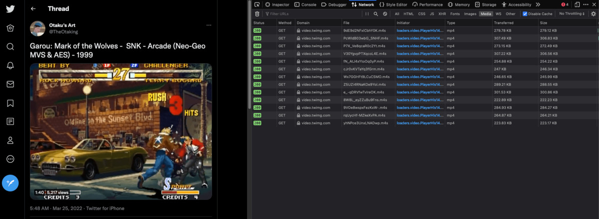
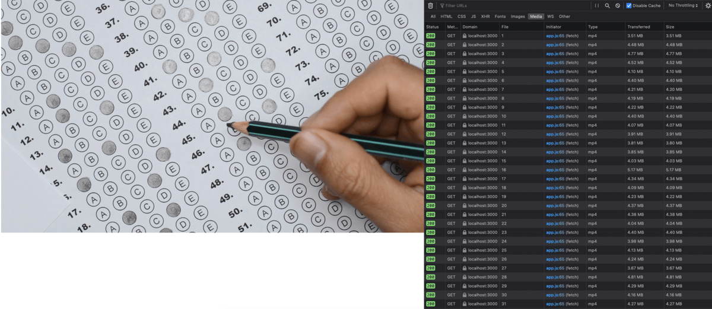

PoC: Stream de videos com javascript no navegador

<abbr title="muito grande; nemli">mg;nl</abbr>: vamos desenvolver um reprodutor de vídeos utilizando a API MediaSource do navegador e o conceito de fragmentação de vídeos, no modelo utilizado por sites como twitter, facebook e netflix.

Ao acessar sites com stream de vídeo, como twitter, facebook ou netflix, e visualizar um vídeo, você pode se deparar com duas situações: Na primeira, o vídeo está encapsulado em uma tag `<video>`, com um `src` ou algumas tags `<source>`, indicando a URL do vídeo.

Neste caso, você pode facilmente, inspecionando a tela, copiar a URL do vídeo e abrí-la em outra aba, ou salvar no seu computador.

Por exemplo: <https://twitter.com/TheOtaking/status/1507809616993742848>

O GIF mostrado na página é, na verdade, um mp4, e, inspecionando a estrutura do html, descobrimos que ele está no seguinte formato:

    <video preload="auto" playsinline="" aria-label="Embedded video" disablepictureinpicture="" style="width: 100%; height: 100%; position: absolute; background-color: black; top: 0%; left: 0%; transform: rotate(0deg) scale(1.005);" poster="https://pbs.twimg.com/tweet_video_thumb/FOzEMPDXEAEE_e5.jpg" src="https://video.twimg.com/tweet_video/FOzEMPDXEAEE_e5.mp4" type="video/mp4"></video>

Você pode facilmente salvar a URL <https://video.twimg.com/tweet_video/FOzEMPDXEAEE_e5.mp4>, reproduzí-la em outros ambientes, ou fazer o download do arquivo.

Na segunda situação, você também encontra uma tag `video`, mas seu atributo `src` não é uma URL comum: se trata de um blob.

Exemplo: <https://twitter.com/TheOtaking/status/1507278342176882730>

O vídeo possui os controles habilitados, e, inspecionando a página, sua estrutura é a seguinte:

    <video preload="none" playsinline="" aria-label="Embedded video" disablepictureinpicture="" style="width: 100%; height: 100%; position: absolute; background-color: black; top: 0%; left: 0%; transform: rotate(0deg) scale(1.005);" poster="https://pbs.twimg.com/ext_tw_video_thumb/1507278264003440640/pu/img/1OLNuDRaCHoKzs1e.jpg" src="blob:https://twitter.com/dfc0270a-52b1-4ea8-a49d-bc9939732deb"></video>

Se você tentar acessar a URL <blob:https://twitter.com/dfc0270a-52b1-4ea8-a49d-bc9939732deb>, ou mesmo <https://twitter.com/dfc0270a-52b1-4ea8-a49d-bc9939732deb>, vai receber um erro de página não encontrada.

Neste post, vamos entender o funcionamento das URLs blob, qual os benefícios do seu uso, e desenvolver uma prova de conceito mostrando como implementar uma funcionalidade de stream em javascript.

## O que são Blobs

O significado direto de Blob é _Binary Large Object_. Se trata de um arquivo binário. Em javascript, e mais especificamente nos navegadores, ele é utilizado para alocar dados arbitrários a um endereço de memória temporário.

Quando você acessou o tweet no exemplo anterior, pode ter reparado que a URL do blob que encontrou no `src` do vídeo não era o mesmo que eu coloquei. Isso é porque a URL de um blob é gerada em função de onde ele foi armazenado, e, se você atualizar a página repetidas vezes, vai reparar que a URL segue mudando.

A principal vantagem de utilizar blobs, no contexto de reprodução de vídeos, é que um blob não precisa ser transmitido integralmente em uma só requisição. 

Uma forma mais eficiente é fragmentá-lo, e direcionar os diversos fragmentos para a mesma blob URL, reduzindo significativamente a quantidade de banda utilizada quando um usuário, por exemplo, acessa um vídeo e desiste de assistí-lo logo nos primeiros segundos.

## Transmitindo um Blob de forma fragmentada

Se você abrir qualquer tweet que contenha um vídeo (grande o bastante para ter os controles habilitados), você pode analisar a forma como os dados são transmitidos através da barra _Network_ das ferramentas de desenvolvedor.

No FireFox, você pode apertar <kbd>F12</kbd> e selecionar _Network_ na aba que abrir.

Se você manter esta aba aberta enquanto visualiza um vídeo, vai perceber que várias novas requisições são realizadas.

Repare que vários arquivos .m4s (como 9dE9d2NFxlCbhY0K.m4s) estão sendo baixados pelo navegador. Mesmo com a extensão .m4s, o navegador os reconhece como .mp4.

Estes arquivos são os diferentes fragmentos do vídeo que estão sendo adicionados ao Blob através do qual a tag `<video>` reproduz o conteúdo.

## Gerando um vídeo fragmentado a partir de um mp4

Mas como estes fragmentos são gerados?

Existem diversas especificações, formatos e ferramentas utilizadas para fragmentar vídeos de forma eficiente.

Neste post, vamos explorar o uso do formato .m4s, devido à facilidade de sua geração de forma automatizada.

Utilizei o vídeo disponível [aqui](https://www.videezy.com/random-objects/11425-multiple-choice-test) pois o tamanho maior facilita a demonstração.

Para gerar a fragmentação, vamos utilizar a ferramenta [MP4Box](https://github.com/gpac/gpac/wiki/MP4Box). Sua instalação pode ser feita, no mac, com o homebrew, rodando:

    brew install mp4box

Veja, no link acima, mais informações sobre como instalar em outros sistemas.

Acesse o diretório onde você salvou o arquivo, e rode o seguinte comando:

    MP4Box -dash 1000 -segment-name chunk -dash-profile live video.mp4

Verifique uma estrutura no seguinte formato, dentro do seu diretório, após rodar o comando:

    ls -l
    Mar 26 18:15 chunk1.m4s
    ...
    ..
    .
    Mar 26 18:15 chunk37.m4s
    Mar 26 18:15 chunkinit.mp4
    Mar 26 18:15 video.mp4
    Mar 26 18:15 video_dash.mpd

Repare que foram criados vários _chunks_, do chunk1.m4s ao chunk37.m4s, no formato _.m4s_, um arquivo _chunkinit.mp4_ e um outro _video\_dash.mpd_.

Cada _chunk_ possui informação referente à um fragmento do vídeo. 

Você não vai conseguir reproduzir estes arquivos soltos em um reprodutor de vídeo.

O arquivo _chunkinit.mp4_ também não pode ser reproduzido sozinho, mas ele possui os metadados necessários para a criação do blocos _mp4_ reproduzíveis pelos programas, ou pelo seu navegador.

Experimente o seguinte teste:

    cat chunkinit.mp4 chunk1.m4s > teste_video.mp4

Agora, abra o _teste\_video.mp4_ com o seu navegador ou reprodutor de vídeo. Você criou um vídeo com cerca de 1s de duração!

Quanto mais _chunks_ forem unidos, maior será a duração do vídeo resultante.

O arquivo _video\_dash.mpd_ guarda as informações gerais do vídeo fragmentado, em formato xml.

    <Period duration="PT0H0M40.085S">
      <AdaptationSet segmentAlignment="true" maxWidth="1920" maxHeight="1080" maxFrameRate="29970/1000" par="16:9" lang="eng" startWithSAP="1">
       <ContentComponent id="1" contentType="video"/>
       <ContentComponent id="2" contentType="audio"/>
       <Representation id="1" mimeType="video/mp4" codecs="avc1.4D002A,mp4a.40.2" width="1920" height="1080" frameRate="29970/1000" sar="1:1" bandwidth="31972015">
        <AudioChannelConfiguration schemeIdUri="urn:mpeg:dash:23003:3:audio_channel_configuration:2011" value="2"/>
        <SegmentTemplate media="chunk$Number$.m4s" initialization="chunkinit.mp4" timescale="29970" presentationTimeOffset="1000" startNumber="1" duration="29970"/>
       </Representation>
      </AdaptationSet>
     </Period>

Repare nas chaves `maxWidth`, `maxHeight`, `maxFrameRate`, `codecs`, `SegmentTemplate`. Esses dados podem ser utilizados para guiar a reprodução de vídeos nas web, mas no nosso exemplo, podem ser descartados. Vamos utilizar uma metodologia mais "manual".

## Disponibilizando o vídeo fragmentado com um servidor web

Vamos simular um sistema de streaming criando um servidor em node.js. Você pode utilizar qualquer linguagem com a qual estiver mais familiarizado.

A lógica do servidor, no nosso exemplo, vai ser extremamente simples.

Crie um projeto e instale o pacote _express_.

    mkdir poc-streaming && cd poc-streaming && npm init -y && npm i express --save

Vamos criar um arquivo `index.js` responsável pelo roteamento e envio dos arquivos para o front end.

    const express = require('express');
    const app = express();
    const port = 3000;
    const fs    = require('fs')
    const path = require('path');

    // disponibiliza nosso front end (public/index.html)
    const staticPath = path.join(__dirname, '/public');
    app.use('/', express.static(staticPath));

    // serve o arquivo equivalente dependendo do parâmetro recebido na requisição
    const stream = async function (req, res, next) {
        const dir = path.join(__dirname, 'videos/example/');
        const files = fs.readdirSync(dir);
        const chunks = files.filter(file => {
            return file.includes('chunk');
        });
        const part = req.params.part;
        if (chunks[part]) {
            const file = `chunk${part}.mp4`;
            res.sendFile(`${dir}${file}`);
        } else {
            res.status(204);
            res.send();
        }
    }

    // lógica modificada para envio de .m4s
    app.get('/stream/:part?', stream);

    app.listen(port, () => {
      console.log(`Example app listening on port ${port}`);
    });

E vamos editar nosso `package.json` para incluir o script que inicia o servidor.

    "scripts": {
      "start": "node index.js"
    },

Atente para os seguintes pontos:

Utilizaremos o diretório `public` para servir os arquivos do front end. Vamos desenvolvê-los a seguir.

A função `stream` recebe um parâmetro, `part`, na URL da requisição. Esse parâmetro define qual pedaço \(chunk\) do vídeo deve ser enviado para o front end.

Os arquivos do vídeo devem estar num diretório `videos/example`.

Apliquei uma verificação básica, usando `readdirSync`, onde tiramos uma listagem dos arquivos presentes no diretório com `chunk` no nome, e verificamos se o _chunk_ solicitado existe.

Mas temos um problema: os arquivos enviados para o front end são no formato _.mp4_.

Vamos resolver isto com um pequeno script em bash. \(Este script também pode ser adaptado para node, mas mantive assim pela simplicidade\).

Rode os seguintes comandos no diretório com o video.mp4, baixado do link na seção anterior.

    MP4Box -dash 1000 -segment-name chunk -dash-profile live video.mp4 # essa parte nós já fizemos
    cat chunkinit.mp4 chunk1.m4s > chunk1.mp4 # vamos criar o arquivo inicial, com os meta dados presentes em chunkinit.mp4
    rm chunkinit.mp4 # não vai mais ser utilizado, podemos remover
    rm chunk1.m4s # mesma coisa
    for f in *.m4s;
      do mv -- "$f" "${f%.m4s}.mp4";
    done
    rm video_dash.mpd # não vamos utilizar no nosso exemplo!

A mágica acontece no `for`. Após enviarmos o primeiro arquivo, que se trata de um mp4 concatenado com o primeiro .m4s, podemos enviar os outros chunks em m4s sem nenhuma alteração. Apenas "enganamos" o navegador, alterando a nomenclatura para .mp4.

Após os comandos acima, a estrutura de `videos/example` deve ser a seguinte:

    ls -l
    chunk1.mp4
    ...
    ..
    .
    chunk37.mp4
    video.mp4

Temos todos os _chunks_, onde o primeiro é a combinação de _chunkinit.mp4_ com _chunk1.m4s_, e os outros foram apenas renomeados para _.mp4_, e também, o vídeo original.

Você pode testar nosso endpoit utilizando:

    npm start # inicia o servidor nodejs
    curl http://localhost:3000/stream/1 > parte1.mp4
    file part1.mp4
    # output esperado: "parte1.mp4: ISO Media, MP4 Base Media v6"

Sucesso! Vamos preparar nosso front end.

## Realizando o streaming no front end

Vamos desenvolver a lógica de streaming utilizando a API [MediaSource](https://developer.mozilla.org/en-US/docs/Web/API/Media_Source_Extensions_API) e, para as requisições, a API [Fetch](https://developer.mozilla.org/en-US/docs/Web/API/Fetch_API).

Crie os dois arquivos `public/index.html` e `public/app.js` \(Certifique-se de que você está na raíz do projeto.\)

    mkdir public
    touch public/index.html

E coloque o seguinte conteúdo:

    <!DOCTYPE html>
    <html lang="en">
    <head>
        <meta charset="UTF-8">
        <meta http-equiv="X-UA-Compatible" content="IE=edge">
        <meta name="viewport" content="width=device-width, initial-scale=1.0">
        <title>PoC Streaming com Javascript</title>
    </head>
    <body>
        <video id="video" controls="true"></video>
        
    </body>
    </html>

Agora, crie o arquivo responsável pela lógica, e vamos desenvolvê-la juntos.

    touch public/app.js

Vamos definir algumas globais para controlar o estado da nossa aplicação:

    const video = document.getElementById('video');
    let assetURL = 'http://localhost:3000/stream/';
    let isFetchingData = false;
    let currentChunk = 1;

A variável `isFetchingData` é uma flag, que vai ser útil para impedir que o mesmo recurso seja baixado mais de uma vez.

`currentChunk` vai manter a informação de qual _chunk_ deve ser baixado na sequência.

    /**
     * Starts streaming fragmented mp4 data into video tag
     */
    function streamIntoVideo() {
        const mimeCodec = 'video/mp4; codecs=avc1.4D002A,mp4a.40.2';
        const isAbleToPlay = 'MediaSource' in window && MediaSource.isTypeSupported(mimeCodec);
        // TODO: should throw error stating that html element was not found
        if (!video) return;
        // TODO: should fallback to playing regular video with src="...mp4"
        if (!isAbleToPlay) return;
        const mediaSource = new MediaSource;

        video.src = URL.createObjectURL(mediaSource);
        // prototype style argument passing! source https://stackoverflow.com/a/11986895
        mediaSource.addEventListener('sourceopen', sourceOpen);
        mediaSource.mimeCodec = mimeCodec;
    }

Essa é a função principal, através da qual chamaremos os outros métodos necessários.

Repare que a variável `mimeCodec` está hardcoded. Esse é um valor que, em uma aplicação real, deve ser extraída de cada vídeo, e enviada para o cliente.

Caso você esteja testando com algum exemplo diferente do que foi fornecido, pode descobrir os codecs necessários utilizando o MP4Box, com o comando:

    raw_codec=$(MP4Box -info video.mp4 2>&1 | grep RFC6381 | awk '{print $4}' | paste -sd , -);
    echo "video/mp4; codecs="$raw_codec

O output, no nosso caso, é: 

    video/mp4; codecs=avc1.4D002A,mp4a.40.2

Em `isAbleToPlay`, verificamos se o navegador comporta o uso da API necessária, e os codecs do vídeo. Em caso negativo, o ideal é fornecer algum método alternativo para visualização \(como um link para download, por exemplo\).

Com nosso `mediaSource` instanciado, vamos adicionar um `eventListener` para o evento `sourceopen`. 

Precisamos aguardar esse evento, pois a criação do `MediaSource` ocorre de forma assíncrona, e, enquanto este evento não disparar, não podemos atrelar a ele um `sourceBuffer`, que é o elemento que recebe os dados do nosso _blob_.

Vamos verificar os passos do método `sourceOpen`.

    /**
     * Handles fetching new chunks of video and appending into current buffer
     */
    function sourceOpen () {
        const mediaSource = this;
        const mimeCodec = this.mimeCodec;
        const sourceBuffer = mediaSource.addSourceBuffer(mimeCodec)
        if (isNaN(video.duration)) { // (1)
            fetchSegment(`${assetURL}${currentChunk}`).then(function(buffer) {
                sourceBuffer.addEventListener('updateend', function (_) {
                    mediaSource.endOfStream();
                });
                sourceBuffer.appendBuffer(buffer);
                currentChunk++;
            });
            video.addEventListener('timeupdate', async function() { // (2)
                // `this` holds the video html element
                const shouldFetch = this.currentTime > (0.75 * this.duration);
                // fetches new data at 75% of video actual duration
                if (shouldFetch && !isFetchingData) {
                    isFetchingData = true;
                    video.pause();
                    const newStream = await fetchSegment(`${assetURL}${currentChunk}`);
                    if (newStream) {
                        sourceBuffer.appendBuffer(newStream);
                        isFetchingData = false;
                        currentChunk++;
                    }
                    video.play();
                }
            })
        }
    };

Dentro dele, começamos adicionando um `SourceBuffer` criado com as informações dos codecs do nosso vídeo.

Em \(1\), verificamos se a propriedade `duration` do nosso vídeo \( que definimos como uma global \) é do tipo `NaN`.

Este `if` tem o objetivo de rodar apenas na inicialização do vídeo: enquanto o elemento `src` do vídeo não for definido, sua duração tem como padrão `NaN`. Então, essa verificação só passa quando não tivermos adicionado nenhum dado ao nosso `sourceBuffer`.

Na primera iteração, portanto, vamos recuperar um segmento de vídeo do nosso backend \(nesse momento, `currentChunk` vai ter o valor `1`\), e acrescentá-lo ao nosso `sourceBuffer`. Neste momento, a duração do vídeo se torna definida, e ele já pode ser iniciado pelo usuário. Isso vai ocorrer no início do carregamento da página.

Também adicionamos um `eventListener` no evento `updateend` do `sourceBuffer`. Isso faz com que o vídeo pare de tocar ao chegar no final do buffer. Em casos em que a internet do usuário cai, e ele só conseguiu baixar parte do vídeo, isso evita que ocorram erros.

Em \(2\), adicionamos a lógica que vai buscar, no servidor, novos _chunks_ sempre que necessário.

Sempre que o contador de tempo do vídeo for atualizado, verificamos se o tempo atual está acima de 75% do total baixado até o momento.

Em caso positivo realizamos nova requisição, e adicionamos o valor recebido \( que é o conteúdo dos nossos arquivos .m4s renomeados \) ao buffer atual.

Isso automaticamente atualiza a duração do vídeo, e assim sucessivamente.

Por ultimo, precisamos da nossa helper function `fetchSegment`. Ela se trata de uma requisição, que verifica se o status code é igual a `204`. Neste caso, entendemos que o vídeo foi baixado integralmente.

    /**
     * Fetch a video or an audio segment, and returns it as an ArrayBuffer, in a
     * Promise.
     * @param {string} url
     * @returns {Promise.<ArrayBuffer>}
     */
    function fetchSegment(url) {
      return fetch(url).then(function(response) {
        if (response.status == 204) {
            return null;
        }
        return response.arrayBuffer();
      });
    }

Agora você já pode testar o funcionamento da nossa prova de conceito, reiniciando o servidor e acessando <http://localhost:3000>. 

Abra a aba de network para verificar as requisições realizadas incrementalmente.

## Conclusões finais

Utilizando algumas ferramentas, como a API MediaSource e Fetch e o programa MP4Box, conseguimos simular um processo de streaming em javascript.

Com este exemplo, fica fácil de entender como é feito o processo de controle nos players de vídeo moderno.

Muitas coisas ficaram em aberto, entretanto. Como lidar com diferentes resoluções de vídeo? Como controlar um usuário que entra no vídeo, pula para o final, e depois volta para o início?

Estas funcionalidades podem ser extendidas a partir do modelo apresentado, refinando a lógica de programação utilizada, com um melhor controle das requisições no lado do servidor, e explorando mais a fundo as funcionalidades do player de vídeo do HTML5.

Vou deixar as referências utilizadas, fique a vontade para explorá-las.

Abraço!

Referências:

1. <https://developer.mozilla.org/en-US/docs/Learn/JavaScript/Client-side_web_APIs/Video_and_audio_APIs>
1. <https://nickdesaulniers.github.io/netfix/demo/bufferAll.html>
1. <https://medium.com/canal-tech/how-video-streaming-works-on-the-web-an-introduction-7919739f7e1>
1. <https://medium.com/swlh/building-a-video-streaming-service-in-javascript-7f751fe76564>
1. <https://stackoverflow.com/questions/16363167/html5-video-tag-codecs-attribute/48991053#48991053>

Tags: streaming, javascript, node, poc
