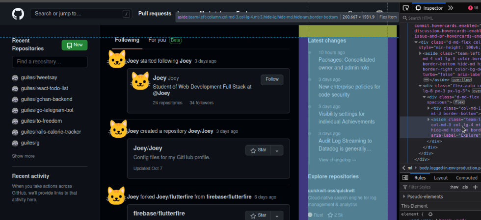
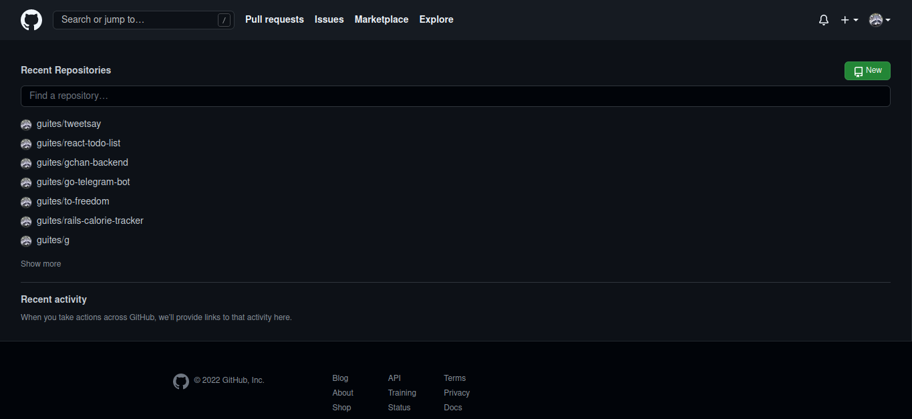

Remova o feed do github

<abbr title="muito grande;nem li">mg;nl</abbr>: vamos criar um bookmarklet pra remover o feed da página inicial do github.

Se você é como eu, provavelmente já entrou no seguinte loop:

1. Você fica com dúvida sobre um projeto hospedado no github
2. Você acessa <https://github.com>.
3. Você fica interessado no que as pessoas andaram fazendo, e acaba clicando em alguma coisa.
4. Você mata a curiosidade e sai do github.
5. ????
6. Você lembra da dúvida sobre o projeto
7. repeat

Vamos remover a distração da homepage do github usando um pouco de javascript.

## Bookmarklets

Bookmarklets são como favoritos, mas ao invés de direcionar para uma nova página, rodam um _snippet_ de javascript na página atual.

Eles precisam seguir as seguintes regras:

1. Ter `javascript:` no início
2. Estar encapsulado numa [IIFE](https://en.wikipedia.org/wiki/Immediately_invoked_function_expression)

Ou seja, deve seguir o seguinte formato:

        javascript:(function(){
          alert("Bookmarklet!");
        })();

## Feed: página inicial do github

Se você está logado, a página inicial do github tem esse formato:

Inspecionando o HTML da página, vemos que a seção principal é dividida em dois containers.

O primeiro contém o menu da esquerda \(menu com os repositórios\):

O segundo é dividido em dois. Primeiro, o feed central:

Depois, o feed com as últimas atualizações e recomendações de repositório:

## Removendo os feeds

Sabendo o markup, podemos utilizar javascript para removê-los.

O feed principal pode ser selecionado pelo seu id:

        document.querySelector("#dashboard-feed-frame")

O feed de atualizações pode ser selecionado pelo seu `aria-role`:

        document.querySelector("aside[aria-label=Explore]")

Podemos utilizar uma iteração para selecionar e removê-los:

        [
            "#dashboard-feed-frame",
            "aside[aria-label=Explore]"
        ].forEach((selector) => document.querySelector(selector).remove())

Você pode ver o resultado na imagem abaixo:

## Ocupando a tela com informações (úteis)

A tela fica meio vazia, e o espaço mau aproveitado, sem os feeds.

Vamos expandir o conteúdo útil. O que sobrou na tela principal pode ser acessado pela classe `.application-main`.

        const appMain = document.querySelector(".application-main");

A estrutura dentro desse elemento é no seguinte formato:

    

        

            <aside data-turbo="false" class="team-left-column ..." aria-label="Account">
                <!-- LISTA DE REPOSITÓRIOS -->
            </aside>
            

                <!-- RODAPÉ -->
            

        

    

A `
` logo abaixo do nosso `appMain` serve como um _wrapper_ flexbox. Vamos adicionar um `flex-direction: column` e centralizar o conteúdo:

    appMain.querySelector("div").style.flexDirection = "column";
    appMain.querySelector("div").style.alignItems = "center";

Vamos também expandir a lista de repositórios para ocupar toda a largura disponível:

        ["aside", "aside div"].forEach((sel) => appMain.querySelector(sel).style.minWidth = "100vw");

Sem distrações!

## O bookmarklet final

O seguinte código vai ajustar sua home em um clique:

        [
            "#dashboard-feed-frame",
            "aside[aria-label=Explore]"
        ].forEach((selector) => document.querySelector(selector).remove());

        const appMain = document.querySelector(".application-main");

        appMain.querySelector("div").style.flexDirection = "column";
        appMain.querySelector("div").style.alignItems = "center";

        ["aside", "aside div"].forEach((sel) => appMain.querySelector(sel).style.minWidth = "100vw");

E, formatado para bookmarklet, fica da seguinte forma:

        javascript:(function(){
            [
                "#dashboard-feed-frame",
                "aside[aria-label=Explore]"
            ].forEach((selector) => document.querySelector(selector).remove());

            const appMain = document.querySelector(".application-main");

            appMain.querySelector("div").style.flexDirection = "column";
            appMain.querySelector("div").style.alignItems = "center";

            ["aside", "aside div"].forEach((sel) => appMain.querySelector(sel).style.minWidth = "100vw");
        })();

## Referências

1. <https://gist.github.com/caseywatts/c0cec1f89ccdb8b469b1>

Tags: bookmarklet, javascript
